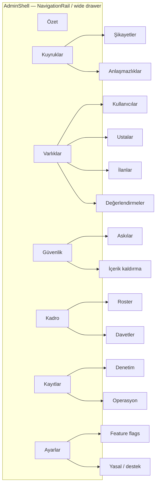

# Admin Console v2 — Profesyonel Yönetim Paneli Tasarımı

| Alan | Değer |
|------|--------|
| **Belge** | Ustasından / alljob — Admin Console v2 Design |
| **Yazar** | _(PM + Systems Architect)_ |
| **Tarih** | 2026-07-13 |
| **Durum** | Draft (rev. 3 — inventory/rules polish; issues 1–18 + polish 1–2 addressed) |
| **Kapsam** | Ayrı admin web uygulaması (`lib/main_admin.dart`, Hosting: `alljob1-admin` → https://alljob1-admin.web.app) |
| **İlgili kod** | `lib/features/admin/**`, `functions/index.js` (admin CF’leri), `firestore.rules` (admin bits), domain modelleri `lib/data/models/**` |
| **Önceki faz** | Admin Faz 2 tamam (şikayet/anlaşmazlık/askı/RBAC/kadro/denetim + cursor sayfalama); bkz. `ILERLEME_NOTLARI.md` Oturum 52–63 |

---

## 1. Overview

Ustasından, müşterileri ustalarla buluşturan bir Flutter pazaryeridir. Yönetim yüzeyi **tüketici uygulamasından tamamen ayrı** bir web giriş noktasıdır (`lib/main_admin.dart` → `AdminApp`). Bugün panel operasyonel olarak “Faz 2 tamam” seviyesindedir: şikayet kuyruğu, anlaşmazlık hakemliği, UID/e-posta ile kullanıcı arama + askıya alma, süper yönetici kadrosu ve denetim kaydı çalışır; yetkili yazmalar Cloud Functions (Admin SDK, `europe-west1`) üzerinden geçer.

Ürün sahibi, bunun ötesinde **profesyonel bir ops/admin konsolu** istiyor: dashboard metrikleri, tam kullanıcı/usta/ilan dizinleri, e-posta ile moderatör daveti, yetenek bazlı izinler, loglar ve bir konsolda beklenen diğer güvenlik/ops yüzeyleri. Bu belge mevcut kodu envanterler, boşlukları doldurur, bilgi mimarisini ve veri/CF/kural değişikliklerini tanımlar; **BigQuery-first değildir** — önce Firestore + CF + mevcut `paged_queue` kalıbı ile değer üreten aşamalı PR planı sunar.

---

## 2. Background & Motivation

### 2.1 Mevcut mimari (gerçek kod)

```mermaid
flowchart TB
  subgraph AdminWeb["Admin Web (ayrı binary)"]
    MA[main_admin.dart]
    AA[AdminApp / _AdminGate]
    Tabs[Şikayetler | Anlaşmazlıklar | Kullanıcılar | Kadro* | Denetim*]
    MA --> AA --> Tabs
  end

  subgraph Auth["Firebase Auth"]
    Claims["custom claims: admin, role, suspended"]
  end

  subgraph CF["Cloud Functions Gen2 · europe-west1"]
    claim[claimAdminAccess]
    setRole[adminSetRole]
    suspend[adminSetUserSuspended]
    resolveR[adminResolveReport]
    assignR[adminAssignReport]
    resolveD[adminResolveDispute]
    writeAudit[writeAuditLog helper]
  end

  subgraph FS["Firestore"]
    users[(users)]
    jobs[(jobs)]
    reports[(reports · admin read)]
    adminRoles[(adminRoles · admin read)]
    audit[(adminAuditLogs · admin read, CF write)]
    artisans[(artisanProfiles · public read)]
  end

  Tabs -->|read| reports
  Tabs -->|read| jobs
  Tabs -->|read| users
  Tabs -->|read| adminRoles
  Tabs -->|read| audit
  Tabs -->|callable| CF
  CF --> Claims
  CF --> FS
  writeAudit --> audit
```

| Katman | Gerçek durum |
|--------|----------------|
| Giriş | `main_admin.dart`: Firebase init, App Check **yalnız** `kAppCheckWebRecaptchaKey` doluysa (şu an **boş** → web App Check pasif) |
| Kabuk | `admin_app.dart`: login → yetkisiz + bootstrap düğmesi → `NavigationBar` sekmeler |
| RBAC | Claim `admin:true` + `role: superadmin\|moderator`. Bootstrap e-posta: `kBootstrapAdminEmails` ↔ `ADMIN_BOOTSTRAP_EMAILS` (şu an `nflx.tr.avs1@gmail.com`) |
| Kullanıcılar | Yalnız `findByUid` / `findByEmail` + `setSuspended` — **dizin yok** |
| Kadro | `adminRoles` stream; rol atama yalnız superadmin (`adminSetRole`) |
| Denetim | `adminAuditLogs` append-only; cursor sayfalama (sayfa 50); istemci filtre `AuditCategory` |
| Kuyruklar | `PagedController` + `fetchPage` (şikayet/anlaşmazlık pageSize 30); rozetler canlı stream |
| Açık şikayet rozeti | **Yaklaşık:** `watchReports` son **200** kaydı `createdAt desc` çeker; istemci `!status.isClosed` süzmesi yapar. Son 200’de kapalı yoğunluğu varsa **açık backlog eksik sayılır**. Tam doğru sayım sayaç/indeksli sorgu olmadan iddia edilmez |
| Açık anlaşmazlık rozeti | `status==disputed` + limit 200 (eşitlik filtresi; backlog >200 ise tavan) |
| Bootstrap claim yazımı | `claimAdminAccess` bugün `setCustomUserClaims(uid, {admin:true, role:"superadmin"})` — **mevcut claim’leri merge etmez** (`suspended` silinebilir). `adminSetRole` / `adminSetUserSuspended` merge kalıbı kullanır. v2 invite/accept **mutlaka merge** etmeli; bootstrap da aynı merge’e çekilmeli (düzeltme notu) |
| Domain (admin UI’da yok) | `Job`, `ArtisanProfile`, `Review`, `Chat` modelleri tüketici app’te var; admin ekranı yok |

### 2.2 Mevcut CF envanteri (admin)

| Callable | Kim | Ne yapar |
|----------|-----|----------|
| `claimAdminAccess` | Bootstrap e-posta + verified | Self → superadmin + `adminRoles` + audit `grant_admin`. **Dikkat:** claim yazımı bugün overwrite (yalnız `{admin, role}`); v2’de mevcut claim merge + roster `{merge:true}` |
| `adminSetRole` | superadmin | `moderator` / `superadmin` / `none`; **claim** merge (`suspended` korunur); roster bugün **full `set` (merge yok)** → v2’de capabilities silinmesin diye merge zorunlu; revoke tokens; audit |
| `adminSetUserSuspended` | herhangi admin | claim + `users.suspended` ayna; admin’i askıya **alamaz**; neden yalnız audit’te |
| `adminResolveReport` | herhangi admin | status + note + audit (batch) |
| `adminAssignReport` | herhangi admin | claim/release report |
| `adminResolveDispute` | herhangi admin | cancel \| restore + bildirim + audit |

Yazma yolu ilkesi (korunacak): **istemci hassas mutasyonu doğrudan Firestore’a yazmaz**; CF + `writeAuditLog`.

### 2.3 Firestore kuralları (admin bits)

- `isAdmin()` → `request.auth.token.admin == true`
- `isSuspended()` → create guard (jobs/offers/messages/reviews)
- `reports`, `adminAuditLogs`, `adminRoles`: **read if isAdmin**, client write false (reports’ta şikayetçi create/update kendi kaydı)
- `users`, `jobs`, `artisanProfiles`, `reviews`: **public/participant read** — admin liste okuması için ek kural gerekmez (chats/offers hariç)
- `chats` / `messages`: **yalnız üye** — admin mesaj içeriği göremez (tasarımda bilinçli karar gerekir)
- `offers`: usta veya iş sahibi — admin teklif dökümanı okuyamaz

### 2.4 Pain points

1. **Operasyon körlüğü:** KPI yok; “kaç açık ilan / kaç askılı / bugün kaç kayıt” için Console’a düşülüyor.
2. **Kullanıcı/usta/ilan keşfi yok:** Yalnız bilinen UID/e-posta; abuse araştırması yavaş.
3. **İzinler ikili:** Moderatore tüm `admin:true` yetkileri açık (askı + şikayet + anlaşmazlık); “sadece şikayet” yok.
4. **Davet yok:** Moderatör eklemek için superadmin’in hedef UID’sini bilmesi ve `adminSetRole` çağırması gerekir; e-posta daveti / pending yok.
5. **İçerik müdahalesi sınırlı:** İlan kaldırma, inceleme gizleme, “featured/verified” admin override CF’si yok (`isVerified` bugün telefon claim ile istemci yazılabilir — admin “güvenilir usta” damgası ayrı düşünülmeli).
6. **Sohbet incelemesi:** Şikayet `targetType=message` + `chatId` taşır ama admin chat okuyamaz → kanıt incelemesi kırık.
7. **Ops log:** Sadece audit trail; CF hata yüzeyi / sistem sağlığı paneli yok.
8. **UI ölçeği:** `NavigationBar` 5 sekme ile sınırda; v2 yüzeyleri için **web-first NavigationRail / drawer** gerekir.

---

## 3. Goals & Non-Goals

### Goals

1. Profesyonel **bilgi mimarisi**: dashboard + entity management + safety queues + staff + settings.
2. **Dashboard KPI’ları** (kaynak, tazelik, maliyet net).
3. **Tam dizinler**: users, artisans, jobs (+ filtre/sayfalama); reviews; sohbet kanıtı yalnız **CF moderated transcript** (K7/K18 — açık admin chat list/read yok).
4. **E-posta ile moderatör daveti** + **capability tabanlı izinler** (binary role üzerine katman).
5. **Denetim + operasyonel görünürlük** (mevcut audit genişletilir; ops sinyalleri).
6. **Safety araçları**: askı (var), içerik takedown, doğrulama/flag, toplu işlem (kontrollü).
7. **Ops**: feature flags / beta bayrakları okuma-yazma (superadmin), yasal metin pointer’ları.
8. **KVKK-uyumlu** PII erişimi, export politikası, audit zorunluluğu.
9. **Aşamalı PR’lar**; her PR review edilebilir ve merge sonrası deploy edilebilir.
10. Mevcut güvenlik modelini **genişlet, yeniden yazma**.

### Non-Goals (bu tasarım turu)

- Tüketici uygulamasına admin UI gömmek.
- BigQuery / Looker birincil analitik (Faz D opsiyonel).
- `firebase-functions` ^6 → ^7 veya `firebase-admin` major zorunlu yükseltme.
- App Check Console enforcement’ı kodla “zorla açmak” (kullanıcı/Console işi; tasarımda risk notu).
- Yeni şifre icat etmek / bootstrap listesini zayıflatmak / self-service public admin signup.
- Ödeme/abonelik gateway admin’i (premium hâlâ beta `premiumFreeDuringBeta`; monetizasyon olgunlaşınca ayrı RFC).
- Gerçek zamanlı canlı sohbet operatör paneli / admin sohbet listesi; kanıt erişimi yalnız rapor bağlamlı CF transcript (K18).

---

## 4. Capability inventory — Current vs Target

| Yetenek | Bugün | v2 hedefi |
|---------|-------|-----------|
| Login + bootstrap superadmin | ✅ | ✅ koru |
| Şikayet kuyruğu + assign/resolve | ✅ | ✅ + filtre (status/reason/target) + hedef deep-link |
| Anlaşmazlık hakemliği | ✅ | ✅ + job detail yan panel |
| Kullanıcı arama UID/e-posta + suspend | ✅ | ✅ + **sayfalı dizin + filtreler** |
| Kadro listesi + setRole | ✅ superadmin | ✅ + **invite-by-email** + **capabilities** |
| Denetim log görüntüleyici | ✅ | ✅ + yeni action kodları + export (superadmin) |
| Dashboard KPI | ❌ | ✅ `adminStats` + kuyruk sayıları |
| İlan (jobs) tarama / takedown | ❌ | ✅ browse + hide/cancel CF |
| Usta profil tarama / verify / feature | ❌ | ✅ browse + `adminSetArtisanFlags` |
| Reviews moderasyonu | ❌ | ✅ liste + soft-hide |
| Chat/mesaj kanıt okuma | ❌ | ✅ CF `adminGetChatTranscript` + **reportId bağlama** + audit (**rules’ta admin chat read yok**) |
| Capability RBAC | ❌ (binary) | ✅ `adminRoles.capabilities` + CF guard |
| Feature flags | ❌ (sadece client const) | ✅ `adminConfig/runtime` superadmin |
| Toplu işlem | ❌ | ⚠️ sınırlı (batch suspend max N) |
| CSV export | ❌ | ⚠️ audit/users metadata, PII minimize |
| System health | ❌ | ⚠️ son CF hataları / sayaç stale uyarısı |
| BigQuery | ❌ | ⏳ Faz D |

---

## 5. Information Architecture

### 5.1 Navigasyon (web-first)

Alt `NavigationBar` 5+ sekmede çöküyor. v2 kabuk:



**UI notları (mevcut desenlere uyum):**

- Türkçe etiketler (mevcut: Şikayetler, Anlaşmazlıklar, Kullanıcılar, Kadro, Denetim).
- `GradientAppBar` + `ResponsiveCenter` (maxWidth 720 → liste ekranlarında 1100–1280).
- Rozetler: açık şikayet / açık anlaşmazlık (mevcut provider’lar).
- Yetkiye göre menü **gizlenir** (sadece UI; asıl engel CF).
- Dar ekranda (`width < 800`) NavigationRail → `NavigationBar` veya drawer fallback.

### 5.2 Rol modeli

Mevcut claim modeli **korunur**:

| Claim | Anlam |
|-------|--------|
| `admin: true` | Kaba kapı — Firestore `isAdmin()`, panel girişi |
| `role: "superadmin"` | Tam yetki + rol atama + config + export |
| `role: "moderator"` | Varsayılan ops; **capabilities** ile inceltilir |
| `suspended: true` | Tüketici kısıtı (admin’ler askıya alınamaz — mevcut) |

**Yeni:** `adminRoles/{uid}.capabilities: string[]` (ve claim’e opsiyonel mirror — bkz. Key Decisions).

### 5.3 Permission matrix

| Capability kodu | Açıklama | `DEFAULT_MODERATOR_CAPABILITIES` | superadmin |
|-----------------|----------|----------------------------------|------------|
| `reports.manage` | Şikayet üstlen/çöz | ✅ | ✅ |
| `disputes.manage` | Anlaşmazlık karar | ✅ | ✅ |
| `users.read` | Kullanıcı dizin/arama | ✅ | ✅ |
| `users.suspend` | Askıya al / aç | ✅ | ✅ |
| `jobs.read` | İlan tarama | ✅ | ✅ |
| `jobs.moderate` | İlan hide/cancel | ✅ | ✅ |
| `artisans.read` | Usta tarama | ✅ | ✅ |
| `artisans.moderate` | verify/feature/unfeature | ✅ | ✅ |
| `reviews.moderate` | Değerlendirme gizle | ✅ | ✅ |
| `chats.read` | Sohbet/mesaj salt okuma (kanıt) | ❌ **opt-in** (superadmin atar) | ✅ |
| `audit.read` | Denetim kaydı | ❌ | ✅ |
| `staff.manage` | Rol/davet/capabilities | ❌ | ✅ |
| `stats.read` | Dashboard | ✅ | ✅ |
| `config.manage` | Feature flags | ❌ | ✅ |
| `export.run` | CSV/JSON export | ❌ | ✅ |

**İsimli sabit (istemci + CF paritesi):**

```js
// functions + Dart const — tek kaynak anlamında kopya, testlerle kilitlenir
const DEFAULT_MODERATOR_CAPABILITIES = [
  "reports.manage", "disputes.manage",
  "users.read", "users.suspend",
  "jobs.read", "jobs.moderate",
  "artisans.read", "artisans.moderate",
  "reviews.moderate",
  "stats.read",
];
// ASLA default'a girmez: chats.read, audit.read, staff.manage, config.manage, export.run
```

**Uygulama kuralı:**

1. UI: `ref.watch(adminCapabilitiesProvider).allows('jobs.moderate')` (§7.3).
2. CF: `assertCap(auth, 'jobs.moderate')` — superadmin her zaman geçer; moderator **explicit list** veya default set.
3. `admin:true` olmadan hiçbir capability geçerli sayılmaz.
4. **Üç durum (server = client):**
   - `role === 'superadmin'` → tüm cap’ler
   - `capabilities` **alanı yok** (`undefined`/`null`) → **geçiş:** log-only pencerede legacy full; enforce sonrası → `DEFAULT_MODERATOR_CAPABILITIES` (chats/export/staff/audit/config **yok**)
   - `capabilities: []` (explicit boş dizi) → **hiçbir** op (kilitli moderatör; bilerek)
   - `capabilities: [...]` → yalnız listedekiler

**Geriye dönük uyumluluk (zorunlu sıra — Issue 4/5):**

1. **PR7a:** `DEFAULT_MODERATOR_CAPABILITIES` sabiti + tüm non-superadmin `adminRoles` dökümanlarına **backfill** (`capabilities` yaz). Superadmin dökümanlarına yazmaya gerek yok (bypass).
2. **PR7b:** `assertCap` **log-only** (reddetmez; `logger.warn` + opsiyonel audit metric).
3. **PR7c:** `assertCap` **enforce**. Bundan sonra missing field da default set gibi davranır (full legacy kalkar).
4. Yüksek hassasiyetli callables (`adminGetChatTranscript`, `adminBulkSuspend`, `export`, `adminUpdateConfig`) **yalnız PR7c enforce canlı olduktan sonra** deploy edilir (veya aynı release’te enforce + bu CF’ler birlikte).

---

## 6. Proposed Design

### 6.1 Kabuk refaktörü

**Dosyalar:** `admin_app.dart` → parçala:

| Bileşen | Sorumluluk |
|---------|------------|
| `AdminApp` | MaterialApp (değişmez) |
| `AdminGate` | auth + isAdmin |
| `AdminShell` | rail + seçili route index / basit `Navigator` veya enum tab |
| `AdminLoginScreen` / `AccessDeniedScreen` | mevcut |
| Ekranlar | `presentation/*_screen.dart` |

Router önerisi (hafif): **GoRouter zorunlu değil** — enum + `IndexedStack`/`Navigator` ile başla (mevcut stille uyumlu). URL deep-link ihtiyaç olursa Faz C’de `go_router` admin-only.

### 6.2 Dashboard (Özet)

#### Metrik seti

| KPI | Kaynak | Tazelik / doğruluk | Not |
|-----|--------|--------------------|-----|
| Açık şikayet (PR5) | Mevcut rozet: son **200** report içinde `!isClosed` | **Yaklaşık** | Kart etiketi: “Son 200 kayıttaki açık” — tam toplam iddia **edilmez** |
| Açık anlaşmazlık (PR5) | `status==disputed` limit 200 | **Yaklaşık** tavan 200 | |
| Açık şikayet/anlaşmazlık (PR6+) | `adminStats/global.openReports` / `openDisputes` | event-driven | create + status transition |
| usersTotal / artisansTotal / usersSuspended | `adminStats/global` | event-driven | transition matrix |
| jobsOpen / jobsInProgress / jobsCompleted / … | `adminStats/global` | event-driven | before/after status bucket |
| Günlük yeni kayıt | `adminStats/daily/{yyyy-MM-dd}` | schedule veya create path | **Timezone: Europe/Istanbul** |
| Premium aktif | sonra | beta N/A | |

#### Sayaç mimarisi (BigQuery yok)

```mermaid
sequenceDiagram
  participant C as Client
  participant FS as Firestore
  participant CF as onWrite handlers
  participant S as adminStats/global

  C->>FS: create/update users|jobs|reports|artisanProfiles
  CF->>CF: before/after diff → delta map
  CF->>S: FieldValue.increment(delta fields)
  Note over CF,S: Admin UI reads adminStats/global; PR5 badges stay approximate
```

**Koleksiyon:** `adminStats/global` + `adminStats/daily/{yyyy-MM-dd}` (Europe/Istanbul gün anahtarı).

**Yazma:** yalnız CF (rules: client write false; read if isAdmin).

#### `adminStats/global` alanları + transition matrix (zorunlu)

| Alan | Anlam |
|------|--------|
| `usersTotal` | users create +1; `deleteAccount` −1 |
| `usersSuspended` | `suspended` false→true +1; true→false −1 |
| `artisansTotal` | artisanProfiles create +1; delete −1 |
| `jobsOpen` / `jobsInProgress` / `jobsCompleted` / `jobsDisputed` / `jobsCancelled` / `jobsOther` | status bucket |
| `openReports` | open/reviewing adedi; create +1; → resolved/dismissed −1; reopen +1 |
| `openDisputes` | job → disputed +1; disputed → * −1 |
| `updatedAt` | her increment sonrası ISO |

**Job `onJobWritten`:** `bucket(before.status)` / `bucket(after.status)`; create → +1 bucket; A→B → −1 A +1 B; delete → −1.  
**Report:** `onReportWritten` trigger **tek kaynak** sayaç (resolve CF sayaç yazmaz — çift sayım yok).  
**Suspend:** `adminSetUserSuspended` içinde `usersSuspended` delta (users mirror trigger yedek değil, tek yol callable).

**Tutarlılık / maliyet:** `FieldValue.increment` concurrent-safe. **Tek döküman hotspot** (~1 write/s soft limit) burst kayıtta risk; &lt;50k user genelde OK. Burst → shard (`adminStats/shards/{0..9}`) veya rebuild. Admin client aggregation query **yapmaz**.

**Daily:** `onSchedule` 00:15 Europe/Istanbul **veya** create-path day increment.

**Stale:** `updatedAt` &gt; 24s → banner. **`adminRebuildStats` PR6 ile birlikte** (superadmin, rate-limited full scan) — yalnız hardening PR’sine bırakılmaz.

**PR5:** “&lt;1 dk doğru toplam” **yok**; yalnızca yaklaşık kuyruk pencereleri.

### 6.3 Entity management

#### 6.3.1 Kullanıcılar

**Bugün:** `AdminUsersScreen` tek sonuç arama.

**Hedef:**

1. Üstte arama (UID / e-posta) — mevcut akış korunur.
2. Altında **sayfalı dizin**: `users` `orderBy createdAt desc` + cursor (`PagedController`).
3. Filtreler (server-side, tek equality + orderBy tercih):
   - `suspended == true`
   - `hasArtisanProfile == true|false`
   - Serbest metin: e-posta/UID (equality veya arama kutusu)
4. İl filtresi **users dökümanında yok** — usta için `artisanProfiles.serviceAreas`; kullanıcı dizininde il filtresi Faz B (denormalize `primaryProvince` opsiyonel, **şimdilik yok**).

**Detay drawer/sheet (mevcut `_UserActionSheet` genişlet):**

- Kimlik: displayName, email, uid, createdAt, phoneVerified, suspended
- Aksiyonlar: suspend/unsuspend (cap), “ustaya git”, “ilanlarını listele”
- Rol yönetimi (staff.manage)
- **PII:** `phoneNumber` public users’ta yok (`private/*`) — admin telefon için ya (a) göstermez MVP, ya (b) superadmin-only CF `adminGetUserPrivate` + audit. **Öneri: MVP’de gösterme**; KVKK riski düşük tut.

**İndeks:** `users` createdAt tek alan otomatik; `suspended + createdAt` için composite eklenebilir.

#### 6.3.2 Ustalar (`artisanProfiles`)

Public read zaten var → admin repo doğrudan okuyabilir.

| Filtre | Alan |
|--------|------|
| Meslek | `profession` |
| Doğrulanmış | `isVerified` |
| Premium | `isPremium` (beta’da gürültülü) |
| Min rating | client-side window veya `averageRating` range (dikkat: range+equality indeks) |

**Aksiyonlar (CF `adminSetArtisanFlags`):**

- `isVerified` admin override? → **Dikkat:** bugün `isVerified` telefon claim ile kullanıcı yazabiliyor. Tasarım: ayrı alan `adminVerified: bool` + UI “platform onaylı” **veya** CF-only `isVerified` + rules’tan client true yazmayı kaldır (breaking).  
  **Karar önerisi:** yeni `trustFlags: { phoneVerifiedMirror, adminVerified, featured }` yerine minimal: CF `adminSetArtisanFlags({ uid, adminVerified?, featured?, moderationHidden? })` ve istemci `adminVerified` yazamasın. Tüketici UI “mavi tik” = phone **veya** adminVerified (ayrı PR tüketici tarafı).

- `featured: bool` — arama sıralamasında boost (tüketici sort ayrı iş; admin bayrağı basar).
- `moderationHidden: bool` — **her moderate yazımında explicit `true|false`** (field delete yok). Profil aramada gizlenir.

Hepsi audit: `set_artisan_flags`.

**Tüketici rozet (K16):** `showVerifiedBadge = phoneVerified (users) / isVerified (phone path) || adminVerified`. UI tooltip: telefon doğrulaması vs **“Platform onaylı”**. Consumer PR10b, PR10 ile **aynı wave** (feature-flag admin “Doğrula” butonu ta ki consumer yayınlanana).

#### 6.3.3 İlanlar (`jobs`)

Public read var.

| Filtre | Not |
|--------|-----|
| `status` | mevcut indeks `status + createdAt` |
| `province` | equality + createdAt → yeni indeks (PR0’da deploy) |
| `category` | mevcut `category+status+createdAt` |
| `customerId` / `selectedArtisanId` | deep-link |

**Aksiyonlar (CF `adminModerateJob`):**

| decision | Etki |
|----------|------|
| `hide` | **`moderationHidden: true`** (alan her zaman bool yazılır; silinmez) + `moderatedBy/At` |
| `unhide` | **`moderationHidden: false`** (delete field **değil**) |
| `force_cancel` | status cancelled + admin note; isteğe bağlı hide ile birlikte |

**Firestore `!= true` tuzağı (K17 — kritik):**  
`where('moderationHidden', '!=', true)` **alanı olmayan dökümanları hariç tutar** → mevcut tüm ilanlar/feed boşalır.  
**Seçilen strateji:**

1. CF hide/unhide her zaman `moderationHidden: true|false` yazar.
2. Tüketici feed **mevcut public query’yi korur**; client veya query tarafında gizlileri elemek için:
   - **Tercih A (MVP güvenli):** feed query değişmez; gizli ilanlar **nadir** → admin `force_cancel` ile open ilanı düşürür (status path zaten feed’de `open` filtreli). `moderationHidden` admin listesi + isteğe bağlı client-side drop **yalnız zaten çekilmiş sayfada**.
   - **Tercih B (ölçek):** tüm job/artisan create path’ine `moderationHidden: false` default yaz (client create + rules allow **yalnız false** create); backfill script `false`; sonra feed `where('moderationHidden','==',false)` + composite index.  
3. **Ürün kararı:** v2 implementasyonu **B’yi hedefler** ama hide UI **PR9b consumer + backfill READY olmadan feature-flag kapalı** (K17). Admin “Gizle” PR9’da CF’yi deploy eder; UI `kAdminModerationActionsEnabled` ta ki PR9b merge.

Dispute zaten `adminResolveDispute`.

#### 6.3.4 Değerlendirmeler (`reviews`)

Public read. Soft-hide: `hiddenByAdmin: true|false` explicit + CF; averageRating yeniden hesap **zor** (`onReviewWritten`).  
**MVP:** hide bayrağı + tüketici listede filtre; rating toplamını **otomatik düşürme yok** (Faz C).

**Admin UI dürüstlüğü (zorunlu kopya):** gizlemek/göstermek sonrası sheet’te sabit uyarı:  
_“Gizlenen değerlendirmeler hâlâ ortalama puana dahildir. Puan düzeltmesi ayrı fazdadır.”_  
Moderatör “takedown rating’i düzeltti” sanmasın.

#### 6.3.5 Sohbetler (kanıt) — bağlama zorunlu (K18)

Chat ID’ler tahmin edilebilir (`chat_{customerUid}__{artisanUid}` review/chat kalıbı). **UI deep-link yetki değildir.**

```mermaid
sequenceDiagram
  participant M as Moderator
  participant UI as Report detail
  participant CF as adminGetChatTranscript
  participant FS as reports + chats/messages

  M->>UI: open report (message/job with chatId)
  UI->>CF: {reportId, chatId, limit?}
  CF->>CF: assertCap chats.read (enforce live)
  CF->>FS: load report; validate context
  CF->>FS: load messages (Admin SDK)
  CF->>CF: audit get_chat_transcript
  CF->>UI: messages[] (max N)
```

**Callable sözleşmesi (PR12):**

```
adminGetChatTranscript({
  reportId: string,   // ZORUNLU
  chatId: string,     // ZORUNLU — report ile eşleşmeli
  limit?: number      // default 100, max 100
})
```

**Sunucu doğrulama (hepsi zorunlu):**

1. `assertCap(auth, 'chats.read')` (enforce; superadmin OK; default moderator set’te **yok**).
2. `reports/{reportId}` exists.
3. Report `status ∈ {open, reviewing}` **veya** `resolved|dismissed` ve `resolvedAt` son **7 gün** içinde (geç kapanmış inceleme penceresi).
4. Bağlam:
   - `targetType === 'message'` ve (`report.chatId === chatId` **veya** `targetId` mesaj/chat tutarlılığı), **veya**
   - `targetType === 'job'` ve `jobs/{targetId}.chatId === chatId`, **veya**
   - `targetType === 'user'` ise **red** (transcript yok; user report’ta sohbet yok) — job/message only.
5. Rate limit: actor başına **20 transcript / saat** (Firestore `adminRateLimits/{uid}` veya memory+warn; aşım `resource-exhausted`).
6. Audit: `action: get_chat_transcript`, `targetType: chat`, `targetId: chatId`, `after: {reportId, messageCount}` — **mesaj metni audit’e yazılmaz**. Audit satırları diğer loglar gibi saklanır (retention Open Question; silme yok MVP).

**Yasak:** yalnız `chatId` ile çağrı; rules’ta `isAdmin()` chat read **yok** (Alternative C reddi korunur).

### 6.4 Moderator invite-by-email

```mermaid
sequenceDiagram
  participant SA as Superadmin
  participant CF as adminCreateInvite / adminAcceptInvite
  participant FS as adminInvites
  participant U as User (existing Auth)

  SA->>CF: adminCreateInvite({email, capabilities[]})
  Note over CF: role fixed moderator; never superadmin
  CF->>FS: revoke other pending for same email
  CF->>FS: adminInvites/{id} pending
  CF->>CF: audit invite_create
  Note over SA,U: Copy-link is UX only — NOT an auth token
  U->>U: Login admin site (email verified)
  U->>CF: adminAcceptInvite()
  CF->>CF: match pending by normalized email
  CF->>CF: merge claims {admin, role} preserve suspended etc
  CF->>FS: adminRoles set merge + capabilities
  CF->>CF: audit invite_accept
```

**Şema `adminInvites/{inviteId}`:**

```json
{
  "email": "mod@example.com",
  "emailNormalized": "mod@example.com",
  "role": "moderator",
  "capabilities": ["reports.manage", "..."],
  "status": "pending|accepted|revoked|expired",
  "createdBy": "uid",
  "createdAt": "ISO",
  "expiresAt": "ISO",
  "acceptedByUid": null
}
```

**Kurallar:** `allow read: if isSuperAdmin()` tercih (claim `role==superadmin`) **veya** staff.manage UI + isAdmin read — **PII:** davet e-postaları prospective staff; **read superadmin-only** (K19). write false.

**Sözleşme / güvenlik (K8, K19):**

| Kural | Detay |
|-------|--------|
| Şifre yok | Davet Auth hesabı yaratmaz / şifre basmaz |
| role | **Yalnız `moderator`**. `superadmin` invite **yasak** — yalnızca `adminSetRole` |
| E-posta | `trim().toLowerCase()`; accept’te `auth.token.email` aynı normalize + `email_verified===true` |
| Tek pending | Aynı e-posta için yeni create → önceki pending’ler `revoked` |
| Zaten admin | `claims.admin===true` → accept **reject** (`failed-precondition`); rol yükseltme `adminSetRole` |
| Claim merge | `newClaims = {...existing, admin:true, role:'moderator'}` — **`claimAdminAccess` overwrite ayağına düşme**; `suspended` korunur |
| Roster write | `adminRoles.doc(uid).set({role, capabilities, email, updatedAt, updatedBy}, {merge: true})` |
| Pending cap | CF: `status==pending` count (createdBy veya global) **≤ 20**; aşım reject. Per-email uniqueness above |
| Copy-link | Admin URL + “giriş yap / daveti kabul et” talimatı — **link authorize etmez**; secret token MVP’de yok. E-posta delivery eklenirse sonra unguessable `token` hash |
| Süre | default 7 gün; `expiresAt` geçmişse accept red |

**E-posta gönderimi:** MVP kopyala-yapıştır. Alternative F: Extension/Trigger Email — sonra.

### 6.5 Capability configuration UI (Kadro) + roster write contract (K20)

`AdminRosterScreen` genişletmesi:

1. Liste (mevcut).
2. Detay: rol chip + capability checkbox grid (yalnız superadmin / staff.manage).
3. Ayrı `adminSetCapabilities` + **`adminSetRole` merge düzeltmesi**.

**Roster write contract (tüm CF’ler — zorunlu):**

| Olay | Yazma |
|------|--------|
| `adminSetRole` role ∈ {moderator, superadmin} | `rosterRef.set({ role, updatedBy, updatedAt }, { merge: true })` — **capabilities silinmez** |
| role → `none` | `rosterRef.delete()` (caps dahil her şey gider) |
| `adminSetCapabilities` | `set({ capabilities, updatedBy, updatedAt }, { merge: true })` — role dokunulmaz |
| moderator → superadmin | caps dökümanda kalabilir (ignore via bypass); demote superadmin→moderator: caps yoksa `DEFAULT_MODERATOR_CAPABILITIES` yaz |
| invite accept | merge set role+capabilities+email |
| `claimAdminAccess` | merge set role superadmin; claim **merge** existing |

**Capability değişince token revoke yok (K21):** server her çağrıda roster okur → UI menü bir sonraki stream’de güncellenir; eski JWT ile CF yine assertCap ile engellenir. Role grant/revoke hâlâ `revokeRefreshTokens` (mevcut).

```js
// pseudo — assertCap after PR7c enforce
async function assertCap(auth, cap, { mode = "enforce" } = {}) {
  if (!auth?.token?.admin) throw new HttpsError("permission-denied", "...");
  if (auth.token.role === "superadmin") return;
  const snap = await db.collection("adminRoles").doc(auth.uid).get();
  const raw = snap.data()?.capabilities;
  let allowed;
  if (raw === undefined || raw === null) {
    // PR7b log-only: treat as full; PR7c+: DEFAULT_MODERATOR_CAPABILITIES
    allowed = mode === "log-only"
      ? null /* full */
      : DEFAULT_MODERATOR_CAPABILITIES;
  } else {
    allowed = raw; // may be []
  }
  if (allowed === null) return; // legacy full log-only window
  if (!allowed.includes(cap)) {
    if (mode === "log-only") {
      logger.warn(`cap miss ${auth.uid} ${cap}`);
      return;
    }
    throw new HttpsError("permission-denied", "Yetki yok: " + cap);
  }
}
```

```js
exports.adminSetCapabilities = onCall({region: REGION}, async (req) => {
  assertSuperadmin(req.auth); // or assertCap staff.manage
  const {uid, capabilities} = req.data;
  validateCaps(capabilities);
  await db.collection("adminRoles").doc(uid).set({
    capabilities,
    updatedBy: req.auth.uid,
    updatedAt: new Date().toISOString(),
  }, {merge: true});
  await writeAuditLog({action: "set_capabilities", ...});
  // NO revokeRefreshTokens — K21
});
```

### 6.6 Logging

#### Audit (mevcut, genişlet)

Yeni action kodları → `AuditEntry.actionLabelTR` + `AuditCategory`:

| action | kategori |
|--------|----------|
| `invite_create` / `invite_accept` / `invite_revoke` | roles |
| `set_capabilities` | roles |
| `moderate_job` | content (yeni kategori) |
| `set_artisan_flags` | content |
| `hide_review` | content |
| `export_run` | system |
| `config_update` | system |
| `stats_rebuild` | system |
| `get_chat_transcript` | privacy |

#### Operasyonel loglar

| Kaynak | Panel gösterimi |
|--------|-----------------|
| Cloud Functions `logger` | “Operasyon” ekranında **link**: Cloud Logging filtresi (proje + function) — panoda log çekmek pahalı/karmaşık |
| Client-caught CF hataları | SnackBar + isteğe bağlı `adminClientErrors` **yazma yok** MVP |
| Sayaç stale / invite expired | Dashboard uyarı kartları |

### 6.7 Safety toolkit

| Araç | Durum | Not |
|------|-------|-----|
| User suspend | ✅ | reason audit-only |
| Report workflow | ✅ | |
| Dispute arbitration | ✅ | |
| Job force cancel / hide | 🆕 | CF |
| Artisan hide / unverify | 🆕 | CF flags |
| Review hide | 🆕 | CF |
| Chat transcript | 🆕 | CF + audit |
| Bulk suspend | 🆕 | max 25/request, aynı reason, audit per target |
| IP/device abuse | ❌ data yok | Non-goal |

### 6.8 Ops / config

**`adminConfig/runtime` (single doc):**

```json
{
  "premiumFreeDuringBeta": true,
  "maintenanceMode": false,
  "minAppVersion": null,
  "updatedAt": "...",
  "updatedBy": "uid"
}
```

- Superadmin UI + CF `adminUpdateConfig`.
- Tüketici app **şimdilik** `AppConstants.premiumFreeDuringBeta` kullanıyor — remote flag okuma **ayrı tüketici PR**. Admin önce yazabilir.
- Yasal: `legal_docs.dart` / `kLegalContactEmail` pointer’ları ayarlar ekranında salt okunur linkler (Hosting yasal site `alljob1`).

### 6.9 Export

- Superadmin + `export.run`.
- Format: CSV client-side from **already loaded pages** (MVP) — sunucu full dump yok.
- Faz C: CF `adminExportUsersMeta` returns signed short-lived data **without phone**, max 5k rows, audit `export_run`.

---

## 7. API / Interface Changes

### 7.1 Yeni / genişletilmiş callables

| Callable | Authz | Input (özet) | Output |
|----------|-------|--------------|--------|
| `adminCreateInvite` | staff.manage | email, capabilities?, expiresInDays? (**role fixed moderator**) | {inviteId} |
| `adminRevokeInvite` | staff.manage | inviteId | {ok} |
| `adminAcceptInvite` | authenticated verified email | — | {granted, role} |
| `adminSetCapabilities` | staff.manage | uid, capabilities[] | {ok} |
| `adminModerateJob` | jobs.moderate | jobId, decision, note? | {ok} |
| `adminSetArtisanFlags` | artisans.moderate | uid, flags | {ok} |
| `adminHideReview` | reviews.moderate | reviewId, hidden: bool | {ok} |
| `adminGetChatTranscript` | chats.read | **reportId**, **chatId**, limit? | {messages[]} |
| `adminUpdateConfig` | config.manage | patch | {ok} |
| `adminRebuildStats` | superadmin | — | {ok, counts} — **PR6** (hardening-only değil) |
| `adminBulkSuspend` | users.suspend | uids[], suspended, reason | {results[]} |

Mevcut callables: PR7b log-only `assertCap` → PR7c enforce. Hassas yeni CF’ler enforce sonrası.

### 7.2 Client repository arayüzleri (öneri)

```dart
// Yeni dosyalar (kalıp: admin_*_repository.dart + Mock + Firebase)
abstract interface class AdminJobRepository {
  Future<List<Job>> fetchPage({String? beforeCursor, int limit, JobStatus? status, String? province});
  Future<void> moderate(String jobId, {required String decision, String? note});
}

abstract interface class AdminArtisanRepository {
  Future<List<ArtisanProfile>> fetchPage({...});
  Future<void> setFlags(String uid, {bool? adminVerified, bool? featured, bool? moderationHidden});
}

abstract interface class AdminStatsRepository {
  Stream<AdminStatsSnapshot> watchGlobal();
}

abstract interface class AdminInviteRepository {
  Stream<List<AdminInvite>> watchPending();
  Future<void> create({required String email, required List<String> capabilities});
  Future<void> revoke(String id);
  Future<void> accept(); // current user
}
```

Providers: `admin_providers.dart` içine ekle; mock override `mock_backend` deseni varsa oraya.

### 7.3 UI capability helper (tam, test edilebilir)

```dart
/// Server assertCap ile aynı üç durum.
/// [capsFieldMissing]: Firestore'da capabilities anahtarı yok.
/// [caps]: explicit liste (boş dizi = hiç yetki).
class AdminCapabilities {
  const AdminCapabilities({
    required this.isSuperAdmin,
    required this.capsFieldMissing,
    required this.caps,
    this.enforceMode = true,
  });

  final bool isSuperAdmin;
  final bool capsFieldMissing;
  final Set<String> caps;
  /// false = PR7b (menü legacy full); true = PR7c+
  final bool enforceMode;

  static const defaultModerator = {
    'reports.manage', 'disputes.manage',
    'users.read', 'users.suspend',
    'jobs.read', 'jobs.moderate',
    'artisans.read', 'artisans.moderate',
    'reviews.moderate', 'stats.read',
  };

  bool allows(String c) {
    if (isSuperAdmin) return true;
    if (capsFieldMissing) {
      return enforceMode ? defaultModerator.contains(c) : true;
    }
    return caps.contains(c);
  }
}
```

Unit tests: superadmin; missing±enforce; explicit `chats.read`; empty set. Dart set ↔ CF `DEFAULT_MODERATOR_CAPABILITIES` string paritesi.

Roster doc stream → `adminCapabilitiesProvider`.

---

## 8. Data Model Changes

### 8.1 Yeni koleksiyonlar / dökümanlar

| Path | Yazan | Okuyan | Amaç |
|------|-------|--------|------|
| `adminStats/global` | CF | isAdmin | KPI |
| `adminStats/daily/{yyyy-MM-dd}` | CF | isAdmin | trend |
| `adminInvites/{id}` | CF | **isSuperAdmin** (PII) | davet |
| `adminConfig/runtime` | CF | isAdmin (veya public read keys subset later) | flags |

### 8.2 Mevcut döküman alan ekleri

| Koleksiyon | Alanlar | Not |
|------------|---------|-----|
| `adminRoles/{uid}` | `capabilities: string[]`, `email?`, `displayName?` (denormalize UX) | email roster kartı için |
| `jobs/{id}` | `moderationHidden: bool` (always true\|false when set), `moderatedBy?`, `moderatedAt?` | CF only; create path later default `false` (PR9b) |
| `artisanProfiles/{uid}` | `adminVerified?: bool`, `featured?: bool`, `moderationHidden: bool` | CF only; **rules denylist client** (zorunlu) |
| `reviews/{id}` | `hiddenByAdmin: bool` | CF only; allowlist already blocks (defense-in-depth) |
| `adminAuditLogs` | aynı şema; yeni action strings | |

### 8.3 Rules deltas (özet)

```
function isSuperAdmin() {
  return isAdmin() && request.auth.token.role == 'superadmin';
}

match /adminStats/{doc} { allow read: if isAdmin(); allow write: if false; }
match /adminInvites/{id} { allow read: if isSuperAdmin(); allow write: if false; }
match /adminConfig/{doc} { allow read: if isAdmin(); allow write: if false; }

// artisanProfiles — ZORUNLU denylist (owner self-set engeli; bugün open)
// create: !keys().hasAny(['adminVerified','featured','moderationHidden'])
//         OR (moderationHidden == false && !adminVerified/featured true)
//   Strategy B (PR9b/10): preferred create payload includes moderationHidden: false only;
//   never allow client create/update with moderationHidden == true / adminVerified / featured.
// update: !diff.affectedKeys().hasAny(['adminVerified','featured','moderationHidden'])

// jobs — Strategy B create invariant (PR9b) — ZORUNLU feed == false öncesi:
// create: !('moderationHidden' in request.resource.data.keys())
//         || request.resource.data.moderationHidden == false
//   (client must default false on create; cannot self-hide/unhide via create)
// update: defense-in-depth — moderationHidden already outside changedOnly allowlist
//   (still document; optional explicit deny if allowlist ever widens)

// reviews — defense-in-depth: hiddenByAdmin outside hasOnly allowlist
```

**Öncelik:**

| PR | Rules |
|----|--------|
| PR9b | **jobs create** guard: missing or `moderationHidden == false` only; create-path default `false` + backfill; then feed `== false` |
| PR10 | **artisanProfiles** denylist create/update for adminVerified/featured/moderationHidden (+ optional create `moderationHidden == false` if Strategy B for artisans) |
| jobs/reviews update | allowlist already blocks; keep as defense-in-depth notes |

**Chat:** rules **değişmez** (member-only kalır); transcript yalnız CF (K7/K18). **Asla** `isAdmin()` chat/messages read eklenmez.

### 8.4 Indexes

| Query | Index |
|-------|-------|
| jobs status + createdAt | ✅ mevcut |
| jobs province + createdAt | 🆕 |
| jobs moderationHidden + status + createdAt | 🆕 (consumer feed) |
| users suspended + createdAt | 🆕 |
| users hasArtisanProfile + createdAt | 🆕 optional |
| artisanProfiles profession + createdAt | 🆕 |
| adminInvites status + createdAt | 🆕 or single-field |
| reports status + createdAt | 🆕 (filtre) |

### 8.5 Migration

1. **PR0** deploy indexes; wait READY.
2. Deploy rules: artisanProfiles denylist (PR10); adminStats/invites/config reads; **PR9b jobs create** `moderationHidden` missing-or-false + client default false + backfill **before** feed `== false`.
3. **PR7a** backfill `adminRoles.capabilities` = `DEFAULT_MODERATOR_CAPABILITIES` for all moderators (**required**, not optional).
4. PR7b log-only → PR7c enforce.
5. PR6 counters from zero + **adminRebuildStats** once; banner until rebuild.
6. No password/auth migration.

---

## 9. Alternatives Considered

### A. BigQuery + scheduled ETL for dashboard

| Artı | Eksi |
|------|------|
| Ölçek, SQL, tarihsel trend | Maliyet, kurulum, gecikme, aşırı mühendislik erken aşamada |
| | Ürün sahibi “hemen panel” istiyor |

**Karar:** Reddedildi (şimdilik). Faz D notu.

### B. Capability’leri yalnız custom claims’te tutmak

| Artı | Eksi |
|------|------|
| Rules’ta `token.caps` okunabilir | Claim boyutu limiti; her cap değişiminde revokeRefreshTokens; setCustomUserClaims merge karmaşası |

**Karar:** Kaynak gerçek `adminRoles.capabilities`; CF server-side assert. İleride sık kullanılan cap’ler claim’e mirror edilebilir.

### C. Admin chat read via Firestore rules `isAdmin()`

| Artı | Eksi |
|------|------|
| Basit UI | Her moderator tüm sohbetleri sorgulayabilir; audit yok |

**Karar:** CF transcript + audit (B yolu).

### D. Tek monolitik “admin SDK” rewrite

| Artı | Eksi |
|------|------|
| Temiz slate | Risk; mevcut 150+ test ve canlı panel regresyonu |

**Karar:** Incremental extend; `PagedController` / audit / suspend kalıplarını yeniden kullan.

### E. Bottom nav’ı zorla 8 sekmeye çıkarmak

| Artı | Eksi |
|------|------|
| Az kod | UX kötü |

**Karar:** NavigationRail / gruplu menü.

### F. Invite e-posta delivery (Extension / Trigger Email) vs copy-link

| Artı | Eksi |
|------|------|
| Daha “pro” onboarding | Provider, spam, secret token tasarımı |

**Karar MVP:** copy-link (UX only). Delivery sonra + hashed token.

### G. Caps’i custom claim’e mirror edip rules’ta chat read

| Artı | Eksi |
|------|------|
| Rules `token` ile chat | Claim size, revoke churn; Alternative C riski |

**Karar:** reddedildi; CF transcript + roster assert (K4/K7).

### H. Admin SDK scheduled full export vs client CSV

| Artı | Eksi |
|------|------|
| Tam döküm | PII, maliyet, abuse |

**Karar MVP:** client CSV yüklü sayfa; sunucu export Faz C + `export.run` + audit.

---

## 10. Security & Privacy (KVKK)

### Threat model (özet)

| Tehdit | Şiddet | Mitigasyon |
|--------|--------|------------|
| Sahte admin claim | Critical | Yalnız CF `setCustomUserClaims`; bootstrap list parity |
| Moderator yetki aşımı | High | Capability assert server-side + DEFAULT set + backfill |
| Transcript probing (guessable chatId) | High | **reportId bağlama** + status window + rate limit + opt-in cap (K18) |
| PII sızıntısı (telefon, mesaj, invite email) | High | phone private; audited transcript; invites superadmin-read |
| Askı self-service bypass | High | rules `isSuspended`; claim mirror |
| Audit silme / sahte audit | High | client write false; only CF |
| Davet e-posta spoof accept | Medium | email_verified + normalized email + expiry; copy-link ≠ authz |
| claim overwrite (bootstrap/accept) | High | **merge** claims; fix claimAdminAccess footgun |
| adminSetRole wipe capabilities | High | roster `{merge:true}` contract (K20) |
| App Check yokken callable abuse | Medium | Auth required; rate; enable App Check |
| Admin account takeover | High | az superadmin; 2FA; revoke on role change |

### KVKK / veri minimizasyonu

- Askı **nedeni** public `users`’ta yok (mevcut) — korunur.
- Export’ta telefon/FCM token yok.
- Transcript erişimi audit’lenir (`get_chat_transcript`); **mesaj gövdesi audit’te yok**.
- Denetim log retention: ürün kararı (ör. 2 yıl) — Open Question; silme yok MVP.
- Admin paneli erişim log’u = `adminAuditLogs` + Auth.

### Bootstrap

- Liste **zayıflatılmaz**; davet sistemi bootstrap’ın yerini almaz.
- `claimAdminAccess` yalnızca bootstrap e-postaları için kalır; **claim merge** ile `suspended` vb. korunur (mevcut overwrite footgun kapatılır).

---

## 11. Observability

| Sinyal | Nasıl |
|--------|-------|
| CF success/error | Cloud Logging `logger.info/warn` (mevcut kalıp) |
| Cap miss (log-only) | `logger.warn` rate; PR7b→7c geçişte permission-denied oranı |
| Audit trail | `adminAuditLogs` UI |
| Open queue depth | PR5 yaklaşık etiket; PR6 sayaç |
| Stats lag / hotspot | `adminStats.updatedAt`; single-doc write contention notu |
| Alerting | Cloud Monitoring: CF error rate; cap deny spike |
| Client | `flutter analyze` + `test/admin_test.dart` (aşağı checklist) |

Metrik hedefleri (ölçek varsayımı &lt; 50k user):

- Admin callable p95 &lt; 2s (europe-west1)
- Dashboard first paint &lt; 1.5s (stats doc + 2 queue counts)
- Liste sayfa (30) &lt; 1s

### Test / mock stratejisi (implementer checklist)

| PR | Zorunlu testler |
|----|-----------------|
| PR2–4 | Mock `fetchPage` cursor; filtre; boş sayfa |
| PR5 | Dashboard etiket metni / yaklaşık sayı (unit UI değil, provider logic) |
| PR6 | Transition matrix pure fn (before/after → deltas); rebuild smoke |
| PR7a–c | `AdminCapabilities.allows` matrix; Mock roster backfill; assertCap log vs enforce (JS unit if extracted) |
| PR8 | invite create unique email; accept reject if already admin; claim merge preserves suspended (mock/CF contract test) |
| PR9–11 | moderate writes set bool true/false; rules denylist notes |
| PR12 | transcript **rejects** bare chatId; requires reportId match; rate limit |
| PR14 | bulk max 25; export audit action |

CF: mümkünse saf helper’ları (`bucketStatus`, `assertCap`, `validateTranscriptContext`) `functions/` içinde export edilip node test ile; yoksa manuel checklist + admin_test client mocks. Mevcut kalıp: Mock repos + `test/admin_test.dart`.

---

## 12. Rollout Plan

### Feature flags

- UI menü: `kAdminV2Sections` / later `adminConfig`.
- **Capability:** PR7a backfill → PR7b log-only → PR7c enforce (metrik: cap miss / permission-denied).
- **Moderation hide UI:** `kAdminModerationActionsEnabled` false until PR9b consumer + backfill READY.
- **Transcript / bulk / export:** gate on PR7c enforce live.

### Aşamalar (revize)

1. **PR0 indexes** early + wait READY.
2. Wave 1: shell + directories (+ optional collapse PR2–4) + honest PR5 dashboard.
3. Wave 2: PR7a→7c then PR8 invites.
4. Wave 3: PR6 stats + rebuild.
5. Wave 4: moderation CF + **blocking consumer siblings** + transcript.
6. Wave 5: config, export, bulk, hardening.
7. App Check key + Console enforce (kullanıcı).

### Rollback

- Hosting: önceki `build/web` redeploy.
- CF: previous revision (Gen2).
- Rules: previous rules file deploy.
- Yeni alanlar geriye dönük uyumlu (okunmazsa zararsız).

### Deploy checklist

```
# 1) Indexes first — wait until Console status READY before filtered UI
firebase deploy --only firestore:indexes
# 2) Rules
firebase deploy --only firestore:rules
# 3) Functions (subset)
firebase deploy --only functions:...
# 4) Admin hosting (consumer alljob1 dokunma)
flutter build web -t lib/main_admin.dart
firebase deploy --only hosting:alljob1-admin
# 5) Consumer sibling builds when moderation filters land
```

---

## 13. Risks

| Risk | Severity | Mitigation |
|------|----------|------------|
| Sayaç drift | Medium | transition matrix + **PR6 rebuild**; banner |
| Single-doc stats hotspot | Low–Med | note; shard later if bursts |
| Firestore `!= true` empties feed | Critical | K17: never use `!=`; default false + `== false` or cancel path |
| Consumer ignores hide | High | **PR9b blocking**; feature-flag admin hide UI |
| Legacy full → chats.read leak | High | DEFAULT set excludes chats; backfill before transcript |
| adminSetRole wipe caps | High | merge contract K20 + regression test |
| Transcript probing | High | reportId bind K18 |
| Index not READY | Medium | PR0 + gate filtered UI |
| App Check still off | Medium | enable before staff growth |
| Chat CF cost / abuse | Medium | max 100 msgs; 20/h; audit |

---

## 14. Open Questions

1. ~~adminVerified vs isVerified display~~ → **Karar K16:** badge = phone path OR adminVerified; distinct “Platform onaylı” tooltip.
2. `moderationHidden` ilanlar müşteri “ilanlarım”da görünsün mü? (öneri: evet, “yönetim tarafından kaldırıldı” rozeti — implementer default unless product overrides)
3. Audit retention ve yasal saklama süresi?
4. E-posta davet provider (MVP copy-link yeterli mi ilk ay)?
5. Moderatore `audit.read` verilsin mi? (default hayır — matrix)
6. Bootstrap listesinde yedek superadmin e-postası?
7. `adminGetUserPrivate` (telefon) hiç açılacak mı?
8. Review rating recalc after hide — Faz C önceliği?

---

## 15. Key Decisions

| # | Karar | Gerekçe |
|---|--------|---------|
| K1 | Admin **ayrı web binary** kalır (`main_admin.dart`, site `alljob1-admin`) | Tüketici binary’sine admin sızmaz; mevcut deploy modeli |
| K2 | Tüm yetkili **yazmalar CF + audit**; client rules write false | Mevcut güvenlik omurgası; hesap verebilirlik |
| K3 | Roller `superadmin\|moderator` korunur; **capabilities** `adminRoles` üzerinde | Breaking claim redesign yok; ince yetki |
| K4 | Capability enforce **CF’de**; UI gizleme yardımcı | Rules claim’siz cap okuyamaz; server source of truth |
| K5 | **PR7a backfill** `DEFAULT_MODERATOR_CAPABILITIES` (chats/export/staff/audit/config **hariç**); missing field enforce sonrası = default set, **full legacy değil**; kısa log-only pencere only | Matrix opt-in + KVKK; anlık kilit riski backfill ile çözülür |
| K6 | Dashboard: **Firestore sayaç dökümanı**, BigQuery değil; PR5 yaklaşık etiketli | Erken maliyet; dürüst metrik |
| K7 | Chat kanıtı: **CF transcript + audit**, rules admin-read değil | KVKK + erişim izi |
| K8 | Davet: pending + accept; **şifre yok**; copy-link ≠ authz; **invite superadmin yasak** | Bootstrap zayıflamaz |
| K9 | NavigationRail / gruplu IA | Profesyonel konsol ölçeği |
| K10 | PII: telefon MVP yok; suspend reason public yok; invites superadmin-read | KVKK |
| K11 | `firebase-functions` major upgrade yok | Canlı risk |
| K12 | App Check key/enforce kullanıcı — staff çoğalmadan | ILERLEME notu |
| K13 | İçerik bayrakları CF-only; artisan denylist zorunlu | self-unhide engeli |
| K14 | PR’lar dikey dilim; indexes PR0; consumer sibling blocking for hide | Mergeable + doğru davranış |
| K15 | TR UI + EN identifiers | Takım pratiği |
| K16 | Verified badge = phone/`isVerified` **OR** `adminVerified`; tooltip ayırır | Admin verify görünür |
| K17 | `moderationHidden` always bool; **asla** query `!= true`; backfill false + `== false` **veya** force_cancel; hide UI flag until consumer | Firestore semantics |
| K18 | Transcript requires **reportId+chatId** server validation + rate limit | Guessable chatId probing |
| K19 | Invite: unique pending email; claim **merge**; reject if already admin; pending cap 20 | Edge cases |
| K20 | All `adminRoles` writes `{merge:true}` except role none → delete | setRole wipe fix |
| K21 | Cap change **does not** revokeRefreshTokens; server re-reads roster | Session lag OK; CF enforces |

---

## 16. References

- `lib/main_admin.dart`, `lib/features/admin/presentation/admin_app.dart`
- `lib/features/admin/data/{admin_user,admin_report,admin_dispute,admin_audit}_repository.dart`, `paged_queue.dart`, `admin_config.dart`, `admin_providers.dart`
- `functions/index.js` — `claimAdminAccess`, `adminSetRole`, `adminSetUserSuspended`, `adminResolveReport`, `adminAssignReport`, `adminResolveDispute`, `writeAuditLog`
- `firestore.rules` — `isAdmin`, `isSuspended`, reports/adminAuditLogs/adminRoles
- `firestore.indexes.json` — jobs status/category composites
- Domain: `lib/data/models/{app_user,job,artisan_profile,review,report,chat}.dart`
- `ILERLEME_NOTLARI.md` Oturum 52–63 (Admin Faz 2)
- Hosting: https://alljob1-admin.web.app
- Package: `functions/package.json` firebase-functions ^6.1.1, firebase-admin ^12.7.0, Node 22

---

## PR Plan

Aşağıdaki PR’lar sırayla, her biri bağımsız review + mümkün olduğunca bağımsız deploy edilebilir dilimlerdir. **Bandwidth kısıtında PR2–4 tek PR’da birleştirilebilir** (review hâlâ mümkün).

### PR0 — Indexes early (gate)

- **Title:** `firestore: deploy composite indexes for admin directories`
- **Files:** `firestore.indexes.json` (`users` suspended+createdAt, hasArtisanProfile+createdAt; `jobs` province+createdAt; optional profession+createdAt artisans; reports status+createdAt if used)
- **Deps:** none
- **Description:** Deploy indexes **first**; **do not enable filtered directory UI** until Console status **READY**. Unblocks Wave 1 safely.

### PR1 — Admin shell v2 (NavigationRail + route groups)

- **Title:** `admin: shell NavigationRail and section IA (no new backend)`
- **Files:** `admin_app.dart` split, `admin_shell.dart`, `admin_nav.dart`, placeholders
- **Deps:** none
- **Description:** Bottom nav → rail/drawer; mevcut 5 ekranı gruplara taşı; yetkiye göre menü. Hosting redeploy.

### PR2 — Users directory (paged list + filters)

- **Title:** `admin: paged users directory with suspended/artisan filters`
- **Files:** `admin_user_repository.dart` (`fetchPage`), `admin_users_screen.dart`, providers, tests
- **Deps:** PR0 (if filters), PR1 preferred
- **Description:** Cursor list + search; gate filtered queries on index READY.

### PR3 — Jobs admin browse (read-only)

- **Title:** `admin: jobs browser with status/province filters`
- **Files:** `admin_job_repository.dart`, `admin_jobs_screen.dart`, providers, tests
- **Deps:** PR0, PR1
- **Description:** Reuse `Job`; no moderate writes; province filter only after index READY.

### PR4 — Artisans admin browse (read-only)

- **Title:** `admin: artisans browser with profession/verified filters`
- **Files:** `admin_artisan_repository.dart`, `admin_artisans_screen.dart`, providers, tests
- **Deps:** PR0, PR1
- **Description:** Reuse `ArtisanProfile`; read-only. *(Optional merge with PR3.)*

### PR5 — Dashboard MVP (honest approximate counts)

- **Title:** `admin: dashboard with labeled approximate queue windows`
- **Files:** `admin_dashboard_screen.dart`, providers
- **Deps:** PR1
- **Description:** Cards **“Son 200 kayıttaki açık şikayet”** / **“Açık anlaşmazlık (max 200)”** — **not** claimed accurate totals. Links to queues. No CF.

### PR6 — adminStats + transition matrix + rebuild

- **Title:** `functions+admin: adminStats transitions, daily Istanbul, rebuildStats`
- **Files:** `functions/index.js` (onWrite deltas, daily schedule, **`adminRebuildStats`**), rules `adminStats`, `admin_stats_repository.dart`, dashboard upgrade, pure-fn tests for deltas
- **Deps:** PR5
- **Description:** Full field list + before/after matrix; Europe/Istanbul day keys; stale banner; single-doc hotspot note. **Rebuild not deferred to hardening-only.**

### PR7a — Capabilities model + backfill + roster UI

- **Title:** `admin RBAC: DEFAULT_MODERATOR_CAPABILITIES, backfill, setCapabilities UI`
- **Files:** CF `adminSetCapabilities`; `adminSetRole` **merge:true** fix; claimAdminAccess claim **merge** fix; backfill script/one-shot; Dart `AdminCapabilities`; roster checkboxes; tests
- **Deps:** PR1 for UI mount (backend can land first)
- **Description:** Backfill all non-superadmin roster docs. **No enforce yet.**

### PR7b — assertCap log-only on existing callables

- **Title:** `functions: assertCap log-only on admin callables`
- **Files:** `functions/index.js` wrap resolve/assign/suspend/dispute/setRole
- **Deps:** PR7a
- **Description:** Never deny; `logger.warn` on miss. Watch metrics.

### PR7c — assertCap enforce

- **Title:** `functions: assertCap enforce + client enforceMode`
- **Files:** CF mode flip; client `enforceMode: true`; missing caps → DEFAULT set
- **Deps:** PR7b + verified backfill
- **Description:** **Gate** for PR8 sensitive paths already safe; **hard gate** for PR12/PR14 export/bulk.

### PR8 — Moderator invite-by-email

- **Title:** `admin: invite moderators by email (create/accept/revoke)`
- **Files:** invite CF’ler, repo, UI, rules superadmin-read, tests (unique email, reject already admin, claim merge)
- **Deps:** PR7a (caps on invite); accept claim path uses merge (K19)
- **Description:** role fixed moderator; no superadmin invite; copy-link UX only; pending cap 20.

### PR9 — Job moderation CF (UI gated)

- **Title:** `admin: adminModerateJob hide/force_cancel (UI feature-flagged)`
- **Files:** `adminModerateJob`, job flags always bool, defense-in-depth comments, admin UI behind `kAdminModerationActionsEnabled`
- **Deps:** PR3, PR7c
- **Description:** CF may deploy early; **enable UI only with PR9b**.

### PR9b — Consumer job visibility (BLOCKING sibling)

- **Title:** `consumer: moderationHidden default false + feed filter == false`
- **Files:** job create path default `false`; **firestore.rules create guard** (`!has moderationHidden || == false`); backfill all jobs `false`; nearby/my feeds `where moderationHidden == false` + index; “kaldırıldı” on owner list optional
- **Deps:** PR9 CF fields exist
- **Description:** **Hard dependency** of turning on hide in admin. No Firestore `!= true`. Create invariant in §8.3 must land **before** feed filter, else new docs without field vanish from `== false` queries.

### PR10 — Artisan flags CF + rules denylist

- **Title:** `admin: artisan flags CF + artisanProfiles field denylist`
- **Files:** `adminSetArtisanFlags`, **rules denylist** adminVerified/featured/moderationHidden, UI flag-gated
- **Deps:** PR4, PR7c
- **Description:** Priority rules fix (owners could self-set today).

### PR10b — Consumer verified badge (sibling)

- **Title:** `consumer: badge phone OR adminVerified + Platform onaylı tooltip`
- **Files:** artisan card/profile widgets
- **Deps:** PR10
- **Description:** Same wave as PR10 enablement (K16).

### PR11 — Reviews list + soft hide + UI honesty

- **Title:** `admin: reviews browser, hide_review, average still includes hidden`
- **Files:** review repo/screen, CF, consumer filter sibling optional, **admin warning copy**
- **Deps:** PR7c
- **Description:** No rating recalc MVP; explicit UI disclaimer.

### PR12 — Chat transcript (context-bound)

- **Title:** `admin: adminGetChatTranscript requires reportId+chatId`
- **Files:** CF validation, rate limit, report detail UI, tests reject bare chatId
- **Deps:** **PR7c enforce live**; chats.read opt-in only
- **Description:** K18; audit without message bodies.

### PR13 — adminConfig runtime + settings

- **Title:** `admin: runtime config and settings UI`
- **Files:** `adminUpdateConfig`, rules, settings screen
- **Deps:** PR7c
- **Description:** Consumer remote read later.

### PR14 — Export + bulk suspend

- **Title:** `admin: CSV export + bulk suspend max 25`
- **Files:** export client; `adminBulkSuspend`; tests
- **Deps:** PR7c enforce
- **Description:** export.run cap; per-uid audit.

### PR15 — Hardening

- **Title:** `admin: production checklist, App Check notes, analyze green`
- **Files:** notes, remaining indexes if any
- **Deps:** prior waves
- **Description:** No functions major upgrade; rebuild already in PR6.

---

### Suggested merge waves (revize)

| Wave | PRs | Deploy notes |
|------|-----|----------------|
| Wave 0 | PR0 | indexes only; wait READY |
| Wave 1 — Visibility | 1, 2–4 (or merged), 5 | hosting; filtered UI after READY |
| Wave 2 — RBAC & staff | 7a → 7b → 7c, 8 | functions + rules + hosting; watch cap metrics |
| Wave 3 — Metrics | 6 | functions + rules + hosting; rebuild available |
| Wave 4 — Moderation | 9+**9b**, 10+**10b**, 11, 12 | admin+consumer; enable flags only when siblings land |
| Wave 5 — Ops | 13, 14, 15 | functions + hosting |

---

### Revision history

| Rev | Date | Notes |
|-----|------|--------|
| 1 | 2026-07-13 | Initial design |
| 2 | 2026-07-13 | Review issues 1–18: transcript binding, moderationHidden semantics, roster merge, DEFAULT caps + PR7a/b/c, stats matrix, honest open counts, invite edge cases, PR plan realism, AdminCapabilities, rules priority, K16–K21, tests, alternatives F–H |
| 3 | 2026-07-13 | Polish: §4/§3 chat = CF transcript not rules; §8.3 + PR9b jobs create guard `moderationHidden` missing\|\|false |

---

*Son: Bu belge Admin Console v2 için uygulanabilir mimari sözleşmedir (rev. 2). Key Decisions veya PR planı değişirse belge güncellenmelidir.*

