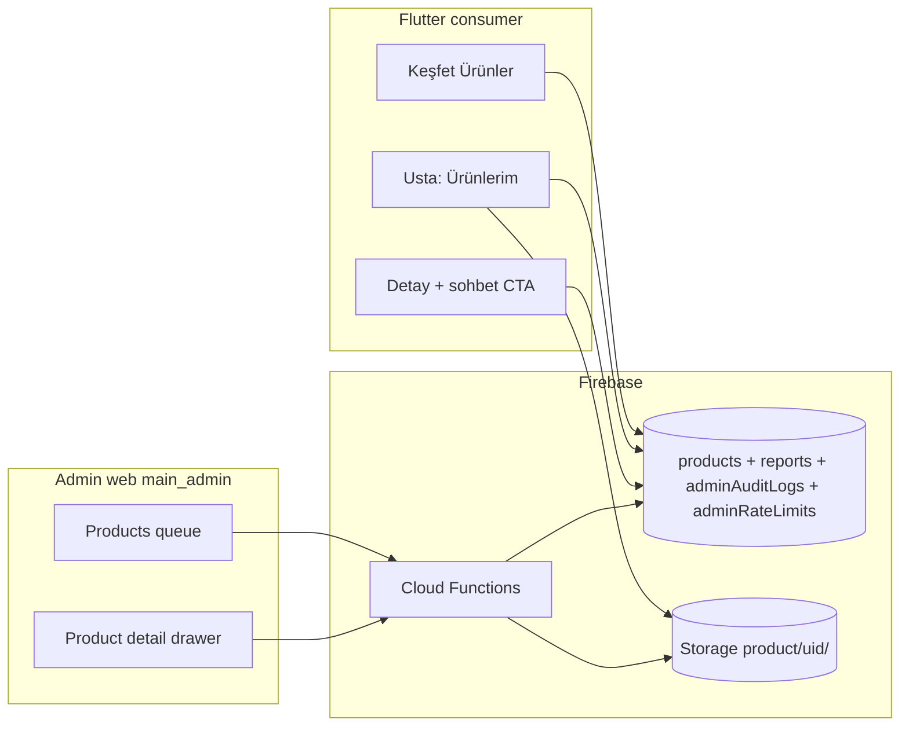
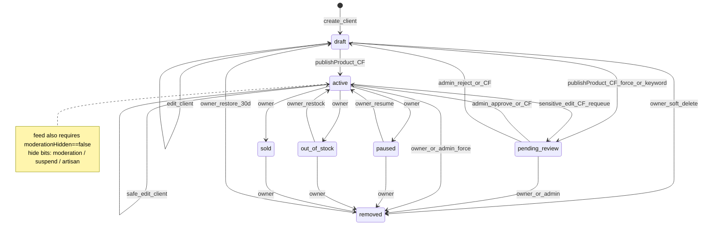
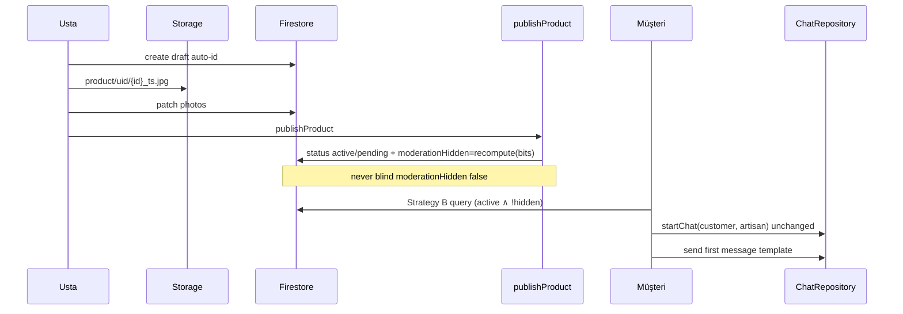

# PRD / Tasarım: Ürün Yaşam Döngüsü (Product Lifecycle) — Keşfet Ürünler

| Alan | Değer |
|------|--------|
| **Belge** | PRD-006 Lifecycle Contract (canonical) |
| **Proje** | Ustasından / Usta Cepte (`alljob1`) |
| **Yazar** | _(TBD)_ |
| **Tarih** | 2026-07-20 |
| **Revizyon** | r4 — recompute invariant on publish/force_remove (K9/K33) |
| **Durum** | Draft |
| **İlgili** | `PRD.md` v4.0 · `docs/ADMIN_PANEL_V2_DESIGN.md` · `docs/SECURITY_AUDIT.md` · `docs/ADMIN_OPS_IA.md` |
| **PRD kaynağı** | **PRD-006 henüz `PRD.md` içine merge edilmedi.** Bu belge Keşfet Ürünler lifecycle için **kanonik** kaynaktır; `PRD.md`’ye kısa stub eklenecek (bkz. §13 K25). Repo’da dual source riskini bilerek yönet. |
| **Kapsam kodu** | Yeni domain: `products` — `jobs` / `staffWorkers` / `staffNeeds` / `artisanProfiles` moderasyon modelini **ayna**lar; paralel güvenlik modeli icat edilmez |

---

## 1. Overview

Usta Cepte bugün Keşfet’te **ustalar** ve **iş ilanları** sunar; `jobs`, `staffWorkers`, `staffNeeds` ve `artisanProfiles` için olgun bir UGC + moderasyon + admin RBAC hattı vardır (`moderationHidden` bool, CF-only hide/unhide, `reports` deterministik ID, `adminAuditLogs`, capability `assertCap`). **Keşfet Ürünler** bu hattın üzerine, ustaların paylaştığı satılık / vitrin ürünlerinin tam yaşam döngüsünü ekler.

Bu belge, bir ürünün sisteme **ilk yüklendiği andan** Storage/Firestore’dan **kalıcı olarak silinmesine** kadar tüm durumları, geçişleri, yetkileri, şemayı, kuralları, Cloud Functions’ları, admin paneli eklemelerini, analytics ve kabul kriterlerini tanımlar. Mühendisler bu sözleşmeden state machine, rules, CF, admin UI ve istemci akışlarını uygulayabilir.

**Çekirdek öneri:** Ürün görünürlüğü iki eksenli kontrol edilir — (1) iş durumu `ProductStatus`, (2) moderasyon bayrağı `moderationHidden: bool` (ADMIN_PANEL_V2 K17: her zaman explicit `true|false`, asla `!= true` sorgusu). Keşfet feed’i yalnız `status == active` **ve** `moderationHidden == false` kayıtlarını listeler (**products greenfield Strategy B** — canlı jobs feed bugün client-filter kullanır; parity iddiası yok, bkz. §4.3.4).

---

## 2. Background & Motivation

### 2.1 Mevcut durum

| Alan | Kod / path | Not |
|------|------------|-----|
| Keşfet | `lib/features/customer/`, segment paneller | Ustalar + İş İlanları; **Ürünler paneli yok** |
| İş ilanı | `lib/data/models/job.dart` | Feed: `status==open` + client `!moderationHidden` (`firebase_job_repository.dart`) |
| Eleman UGC | `staffWorkers`, `staffNeeds` | `moderationHidden` + `adminModerateStaffing` (cap: `jobs.moderate`) |
| Moderasyon CF | `adminModerateJob`, `adminModerateStaffing`, `adminSetArtisanFlags` | hide/unhide (+ job force_cancel) + audit |
| Şikayet | `reports` + `ReportTarget` | product **yok** |
| Admin yetki | `DEFAULT_MODERATOR_CAPABILITIES` / `ALL_CAPABILITIES` | products.\* **yok**; `validateCapabilities` bilinmeyen kodu reddeder |
| Rate limit | `adminRateLimits/{key}` + `istanbulDayKey` | örn. `support_{uid}` — client r/w false |
| Vitrin | `shop_completion.dart` | `canMatchJobs` = **yalnız** meslek + bölge; `photoOk` ayrı |
| Storage | `storage.rules` | `profile\|work\|job\|certificate\|chat` — **product yok** |
| Hesap silme | `deleteAccount` + `STORAGE_FOLDERS` | product cascade **yok** (staffing KVKK fix sınıfı) |
| Admin UI şablon | `admin_jobs_screen.dart`, `paged_queue.dart`, `admin_reports_screen.dart` | Ayrı **Eleman** rail ekranı yok; staffing moderate CF-only |

**Kod tabanında henüz `products` feature yok.**

### 2.2 Pain points

- Ustaların iş örnekleri yalnızca `workPhotos`; fiyatlı/etiketli ürün keşfi yok.
- UGC + silinen hesapta yayında kalan içerik (staffing öncesi boşluk sınıfı) KVKK/Play riski.
- Admin şikayet hedefi ürün olmadan kör nokta.

### 2.3 Bağımlı sistemler



---

## 3. Goals & Non-Goals

### 3.1 Goals

1. Kanonik state machine (`ProductStatus` + `moderationHidden`).
2. Her geçiş için aktör + **rules-ready** owner allowlist.
3. Firestore/Storage/CF/admin/analytics/AC implementasyona hazır.
4. Mevcut desenler: always-bool hide, `reportDocId`, `writeAuditLog`, `assertCap`, `adminRateLimits`, `deleteAccount`/`STORAGE_FOLDERS`.
5. **Client write path açılmadan** account-delete + storage cascade deploy (K13 / KVKK).

### 3.2 Non-Goals (MVP)

- Ödeme / sepet / sipariş / kargo / komisyon.
- AI vision/text model moderasyonu.
- BigQuery.
- Ürün yıldız yorumları.
- ERP / çok satıcılı stok.
- Web mağaza CMS.
- Chat dökümanına `contextProductId` şema genişletmesi (MVP sohbet: mevcut `startChat` + ilk mesaj şablonu — K16).

---

## 4. Proposed Design

### 4.1 Domain tanımı

**Ürün (`product`):** Ustanın (`ownerUid`) Keşfet vitrin kaydı. İletişim: uygulama içi sohbet (`PRD.md` §5).

| Rol | Kim | Lifecycle |
|-----|-----|-----------|
| **Owner** | `ownerUid == auth.uid` + artisan profil | draft CRUD, publish CF, lifecycle client transitions (§4.2.4), soft-delete/restore |
| **Viewer** | misafir/müşteri/usta | Discover query sonucu; UX: active∧!hidden |
| **System CF** | Admin SDK | publish, rate limit, multi-reason cascade, purge, stats, reportCount; content requeue is **owner callable** `updateProductContent` (not onProductWritten primary) |
| **Moderator** | `admin` + `products.moderate` | hide/unhide/approve/reject/force_remove |
| **Superadmin** | `role==superadmin` | + `hard_purge` (veya explicit `products.purge`) |

### 4.2 State machine

#### 4.2.1 `ProductStatus` (Firestore string)

| Değer | TR | Keşfet | Owner list | Anlam |
|-------|-----|--------|------------|--------|
| `draft` | Taslak | Hayır | Evet | Yayınlanmadı / reject sonrası |
| `pending_review` | İncelemede | Hayır | Evet | Publish veya sensitive requeue |
| `active` | Yayında | Evet* | Evet | *ve `moderationHidden==false` |
| `paused` | Duraklatıldı | Hayır | Evet | Owner unlist |
| `out_of_stock` | Stokta yok | **Hayır (MVP)** | Evet | Restock → active |
| `sold` | Satıldı | Hayır | Evet | Yeniden liste = **yeni draft kopya** (aynı id’ye dönülmez) |
| `removed` | Kaldırıldı | Hayır | Evet (≤30g) | Soft-delete tombstone |

**`purged` client enum’da yok.** Hard delete = döküman yok; analytics event `product_purged`; audit action `purge_product`.

**Ayrı eksenler:**

| Alan | Tip | Yazan | Anlam |
|------|-----|-------|--------|
| `moderationHidden` | bool always | **CF only** | **Discover gate (denorm OR).** `= hiddenByModeration \|\| hiddenByUserSuspend \|\| hiddenByArtisanHide`. Feed yalnız bunu sorgular |
| `hiddenByModeration` | bool | **CF only** | Admin `hide` veya report auto-hide. Unsuspend/artisan-unhide **asla** temizlemez |
| `hiddenByUserSuspend` | bool | **CF only** | Kullanıcı askı cascade. Unsuspend yalnız bunu temizler |
| `hiddenByArtisanHide` | bool | **CF only** | Usta profil `moderationHidden` cascade. Artisan unhide yalnız bunu temizler |
| `featured` | bool | CF only | Sayfa içi boost (server multi-sort yok) |

**Multi-reason hide (K9) + recompute invariant (K33):** Tek string `visibilityCascade` **yok**. Missing bool = `false` (`fromMap` / CF `d.hiddenByX === true`).

```
function recomputeModerationHidden(d) {
  return d.hiddenByModeration === true
      || d.hiddenByUserSuspend === true
      || d.hiddenByArtisanHide === true;
}
```

**K33 — tek kural (tüm CF yazımları):**  
`moderationHidden` **yalnız** `recomputeModerationHidden(...)` ile set edilir. Hiçbir callable (publish, content, moderate, suspend, report auto-hide) bit’leri okumadan `moderationHidden: false|true` **kör yazmaz**.  
`moderationHidden: false` **yalnız** ilgili bit(ler) doğru path ile temizlendikten sonra recompute sonucu false olduğunda oluşur:

| Bit | Temizleyen path |
|-----|-----------------|
| `hiddenByModeration` | yalnız admin `unhide` (veya hard_purge doc delete) |
| `hiddenByUserSuspend` | yalnız unsuspend cascade |
| `hiddenByArtisanHide` | yalnız artisan unhide cascade |

> **Create (client):** `moderationHidden: false` zorunlu; hide-reason bools **omit**.  
> **Publish / diğer CF:** asla “false doğrula / force false” yok — her zaman recompute (bkz. §4.3.2).  
> Feed: `where('moderationHidden','==',false)`. **Asla** `!= true`.

#### 4.2.2 Geçiş diyagramı



#### 4.2.3 Aktör × geçiş özeti

| From → To | Owner client | Owner via CF | System CF | `products.moderate` | Superadmin / `products.purge` |
|-----------|--------------|--------------|-----------|---------------------|-------------------------------|
| — → `draft` | create | — | — | — | — |
| `draft` content edit | ✅ | — | — | — | — |
| `draft` → `active` | **❌ asla** | `publishProduct` | auto path | — | — |
| `draft` → `pending_review` | **❌** | `publishProduct` | keyword/force | — | — |
| `pending_review` → `active` | **❌** | — | rare | `approve` | ✅ |
| `pending_review` → `draft` | **❌** | — | auto fail | `reject` | ✅ |
| `active` safe fields | ✅ status sabit | — | denorm | — | — |
| `active` → `pending_review` (content) | **❌** | **`updateProductContent`** | defense-in-depth optional only | — | — |
| `active` → `paused`/`out_of_stock`/`sold` | ✅ | — | — | — | — |
| `paused`\|`out_of_stock` → `active` | ✅ resume/restock | — | — | — | — |
| `*` (owner set) → `removed` | ✅ soft-delete | — | account hard-del | `force_remove` | ✅ |
| `removed` → `draft` | ✅ restore ≤30g | — | — | — | — |
| doc delete | **❌** | — | purge / deleteAccount | — | `hard_purge` |
| `moderationHidden` flip | **❌** | — | cascade/auto-hide | hide/unhide | ✅ |

#### 4.2.4 Owner client status transition allowlist (RULES-READY)

Bu tablo `firestore.rules` ve `canOwnerTransition(from, to)` pure helper’ın tek kaynağıdır.

**A) Client’ın `status` alanını değiştirebileceği çiftler (yalnız bunlar):**

| `resource.data.status` (from) | `request.resource.data.status` (to) | Aksiyon | Ek constraints |
|-------------------------------|--------------------------------------|---------|----------------|
| `draft` | `draft` | content + safe edit | status değişmez; **tek status content client yazılabilir** |
| `draft` | `removed` | soft-delete | `removedAt` ISO, **`removedBy == 'owner'`** (zorunlu) |
| `pending_review` | `removed` | soft-delete only | tombstone fields; **hiçbir safe/content diff yok** (`pendingReviewLocked`) |
| `active` | `active` | **yalnız safe field** | content unchanged (`contentDraftOnly`) |
| `active` | `paused` | pause | content/safe lifecycle-only keys |
| `active` | `out_of_stock` | oos | |
| `active` | `sold` | sold | `soldAt` ISO set |
| `active` | `removed` | soft-delete | `removedBy == 'owner'` |
| `paused` | `active` | resume | content unchanged (pause-edit-resume **yasak** — content yalnız draft veya CF) |
| `paused` | `paused` | safe-only edit | content unchanged |
| `paused` | `removed` | soft-delete | `removedBy == 'owner'` |
| `out_of_stock` | `active` | restock | content unchanged |
| `out_of_stock` | `out_of_stock` | safe-only | content unchanged |
| `out_of_stock` | `removed` | soft-delete | `removedBy == 'owner'` |
| `sold` | `sold` | safe-only (minimal) | content unchanged |
| `sold` | `removed` | soft-delete | `removedBy == 'owner'` |
| `removed` | `draft` | restore | content may then be edited in draft; re-publish required |
| `pending_review` | `pending_review` | **yasak** (no-op bile field diff yok) | yalnız → `removed` |

**B) Client’ın `status` olarak ASLA yazamayacağı hedefler:**

- Herhangi bir from → `active` **eğer from ∈ {`draft`, `pending_review`}** (publish bypass engeli).
- Herhangi bir from → `pending_review` (yalnız CF: publish veya sensitive requeue).
- `sold` → `active` / `draft` (yeniden liste = yeni döküman).
- `removed` → `active` (restore yalnız `draft`).

**C) Rules pseudo-function:**

```
function ownerStatusTransitionOk() {
  let from = resource.data.status;
  let to = request.resource.data.status;
  return (from == 'draft' && to == 'draft')
    || (from == 'draft' && to == 'removed')
    || (from == 'pending_review' && to == 'removed')
    || (from == 'active' && to in ['active', 'paused', 'out_of_stock', 'sold', 'removed'])
    || (from == 'paused' && to in ['paused', 'active', 'removed'])
    || (from == 'out_of_stock' && to in ['out_of_stock', 'active', 'removed'])
    || (from == 'sold' && to in ['sold', 'removed'])
    || (from == 'removed' && to == 'draft'); // + ownerRestoreOk: removedBy==owner
  // NOT: pending_review → pending_review YASAK (field lock; only → removed)
}

function ownerNeverPublishesViaStatus() {
  return !(request.resource.data.status == 'active'
           && resource.data.status in ['draft', 'pending_review']);
}

function ownerSoftDeleteFieldsOk() {
  return request.resource.data.status != 'removed'
    || (request.resource.data.removedBy == 'owner'
        && request.resource.data.removedAt is string);
}
```

**D) `setLifecycle` repository API:** client `update` with status ∈ allowlist only — **not** a separate CF for pause/resume/oos/sold/remove. Content asla lifecycle client path’inden geçmez.

#### 4.2.5 Field groups + content lock (K4 r3 — pause-edit-resume kapalı)

| Grup | Alanlar | Client ne zaman yazabilir? |
|------|---------|----------------------------|
| **Content (sensitive)** | `title`, `titleFold`, `description`, `photos`, `categoryCode` | **Yalnız `status == draft`** (create/update draft). `removed→draft` restore sonrası da draft. Diğer tüm status: **yalnız CF `updateProductContent`** (Admin SDK) → patch + `status=pending_review` + `updatedAt`. |
| **Safe** | `priceType`, `priceAmount`, `quantity`, `tags`, `tagsFold`, `condition`, `district`, `province`, `currency` | `draft`, `active`, `paused`, `out_of_stock`, `sold` — **ama `pending_review` değil** |
| **Lifecycle** | `status`, `soldAt`, `removedAt`, `removedBy`, `removedReason` | §4.2.4; soft-delete’te `removedBy` **zorunlu `'owner'`** |
| **Denorm owner** | `ownerName`, `ownerPhotoURL` | Owner refresh own products |
| **Server-only (create omit; update hasOnly may retain after CF)** | `moderationHidden`, `hiddenByModeration`, `hiddenByUserSuspend`, `hiddenByArtisanHide`, `moderatedBy`, `moderatedAt`, `adminModerationNote`, `moderationNote`, `featured`, `reportCount`, `viewCount`, `publishedAt`, `schemaVersion` | Client **affectedKeys** ile değiştiremez; create’te seed edemez |

**K4 kilit (option 1 — preferred):**

1. Rules: `contentDraftOnly()` — content keys change only if `resource.data.status == 'draft'` (and result still draft or removed).
2. Pause / oos / sold / active: content keys **unchanged** on every client write (resume cannot smuggle new title/photos).
3. To change content while listed: UI calls **`updateProductContent`** → always requeues `pending_review` (feed drops). **No** “pause → edit → resume” path.
4. `needsRereview` **yok**.

**`pending_review`:** `pendingReviewLocked()` — yalnızca `status: removed` + tombstone (`removedAt`, `removedBy=='owner'`, `removedReason?`, `updatedAt`). Safe/content/lifecycle başka diff **yasak**.

### 4.3 Yaşam döngüsü aşamaları

#### 4.3.1 Draft / Create

**UI:** Profil → Usta → Ürünlerim. Routes: `/products/mine`, `/products/new`, `/products/:id`.

**ID ve medya sırası (chicken/egg yok):**

1. Repository `products.doc()` → **auto-id** `productId` (Firestore `doc().id` / `add` öncesi id).
2. Create draft dökümanı (photos `[]` OK).
3. Upload: `product/{uid}/{productId}_{ts}.jpg`.
4. Patch `photos` array.

**AppConstants (yeni):**

```dart
static const int maxProductPhotos = 8;       // rules photos.size() <= 8
static const int productTitleMin = 3;
static const int productTitleMax = 80;       // rules <= 80 (jobs client 80 / rules 120 — products tighter)
static const int productDescMin = 10;
static const int productDescMax = 2000;      // rules parity jobs description
static const int maxProductTags = 8;
static const int maxActiveProductsPerOwner = 50;
static const int productDiscoverFetchCap = 60; // openJobsFetchCap parity
static const int productSoftDeleteDays = 30;
```

**ProductPublishEligibility** (pure; `ShopCompletion` karıştırma):

```dart
bool canPublishProduct({
  required bool canMatchJobs,      // meslek + bölge ONLY
  required bool photoOk,           // ayrı — canMatchJobs içinde DEĞİL
  required bool artisanExists,
  required bool artisanModerationHidden,
  required bool userSuspended,
  required bool fieldsComplete,    // title/desc/photos/price/category/province/condition
}) =>
  canMatchJobs &&
  photoOk &&
  artisanExists &&
  !artisanModerationHidden &&
  !userSuspended &&
  fieldsComplete;
```

Draft create: e-posta doğruluğu + `!suspended` + artisan var (gevşek alanlar). Publish: full eligibility.

**Zorunlu publish alanları:**

| Alan | Kural |
|------|--------|
| `title` | 3–80, trim |
| `description` | 10–2000 |
| `categoryCode` | **meslek kodu** (`kProfessionNames` / professions.json) — ayrı product taxonomy yok (K14) |
| `photos` | 1..8 HTTPS URL |
| `priceType` | `fixed` \| `negotiable` \| `from` |
| `priceAmount` | `fixed`/`from` → number > 0; `negotiable` → null OK |
| `province` | non-empty string ≤ 40 |
| `condition` | `new` \| `like_new` \| `used` \| `handmade` |

**Opsiyonel:** `tags[]` (max 8, 2–24 char, fold), `district`, `quantity` int ≥0.

**Timestamps:** Tüm tarih alanları **ISO-8601 string** (`DateTime.toIso8601String()` / CF `new Date().toISOString()`). **serverTimestamp kullanılmaz** (jobs/staffing parity).

**Create defaults (client payload — `productCreateKeysOk` ile birebir hizalı):**

```json
{
  "schemaVersion": 1,
  "ownerUid": "<auth.uid>",
  "ownerName": "<denorm>",
  "ownerPhotoURL": "<denorm or null>",
  "title": "",
  "titleFold": "",
  "description": "",
  "categoryCode": "",
  "tags": [],
  "tagsFold": [],
  "photos": [],
  "priceType": "negotiable",
  "priceAmount": null,
  "currency": "TRY",
  "condition": "handmade",
  "quantity": 1,
  "province": "",
  "district": null,
  "status": "draft",
  "moderationHidden": false,
  "createdAt": "<ISO>",
  "updatedAt": "<ISO>"
}
```

**Create’te OMIT (allowlist dışı — client yazmaz):**  
`hiddenByModeration`, `hiddenByUserSuspend`, `hiddenByArtisanHide`, `featured`, `publishedAt`, `soldAt`, `removedAt`, `removedBy`, `removedReason`, `reportCount`, `viewCount`, `favoriteCount`, `moderatedBy`, `moderatedAt`, `adminModerationNote`, `moderationNote`.

**Defaults when missing (client `fromMap` + CF cascade):**

| Alan | Missing ⇒ |
|------|-----------|
| `hiddenByModeration` / `hiddenByUserSuspend` / `hiddenByArtisanHide` | `false` |
| `featured` | `false` |
| `reportCount` / `viewCount` | `0` |
| `moderationHidden` | create requires explicit `false`; read path: `== true` only if true |

> Option B (K29): hide-reason bools ve `featured` create allowlist’te **yok**; cascade pseudocode `d.hiddenByUserSuspend === true` (missing = false). `moderationHidden: false` create’te **zorunlu** (jobs style).

#### 4.3.2 Submit / Publish

**Tek kapı:** callable `publishProduct({ productId })` — `CONSUMER_CALL_OPTS` (`enforceAppCheck: true`).

**MVP publish routing (trust tier YOK — K15) + visibility (K33):**

| Koşul | Sonuç |
|-------|--------|
| Eligibility fail | `failed-precondition` — status değişmez |
| Rate limit fail | `resource-exhausted` |
| `adminConfig.runtime.productsForceReview == true` | status → `pending_review` |
| Keyword / contact-pattern hit | status → `pending_review` (+ `moderationNote`) |
| Aksi halde | status → `active`; `publishedAt = now` if null; `updatedAt = now` |

**Visibility patch on every successful publish (zorunlu — asla kör `false`):**

```
// existing hide bits: DO NOT clear on publish
const bits = {
  hiddenByModeration: d.hiddenByModeration === true,
  hiddenByUserSuspend: d.hiddenByUserSuspend === true,
  hiddenByArtisanHide: d.hiddenByArtisanHide === true,
};
patch.moderationHidden = recomputeModerationHidden(bits);
// NEVER: patch.moderationHidden = false
// NEVER: clear hiddenByModeration / UserSuspend / ArtisanHide here
```

| Hide bits after recompute | Status sonucu | Discover | Owner UX |
|---------------------------|---------------|----------|----------|
| all false (ilk publish / temiz) | `active` veya `pending_review` | `active` ∧ !hidden → görünür | normal |
| any true (admin hide, report auto-hide, suspend, artisan hide) | **yine** `active` / `pending_review` (lifecycle ilerler) | **gizli** (`moderationHidden==true`) | Banner: “Yönetim/hesap kısıtı nedeniyle Keşfet’te gizli; durum yayında olabilir” |

**Tercih (K33 preferred):** Publish **reject etmez** hide bit yüzünden — owner status’u `active` yapabilir ama feed’e girmez ta ki doğru unhide path bit’i temizleyene kadar. Alternatif reject (`failed-precondition` “ürün yönetim tarafından gizli”) **kullanılmaz** (owner taslağı/içeriği güncelleyip yayın state’ine alabilsin; ops unhide sonrası anında feed’e düşer).

**Rate limit — `adminRateLimits` (K17):**

- Doc: `adminRateLimits/product_publish_{uid}`
- Pattern: `createSupportTicket` transaction + `istanbulDayKey`
- Limits: **10 publish / Europe/Istanbul takvim günü**; ek: min **30s** arası publish (burst)
- Rules: collection zaten client r/w false
- Errors (TR):
  - day: `"Günlük ürün yayın limitine ulaştınız (10). Yarın tekrar deneyin."`
  - burst: `"Çok sık yayın denemesi. Biraz sonra tekrar deneyin."`

**Active tavan:** CF counts `status in [active,paused,out_of_stock]` ≤ 50; aşımsa `failed-precondition`.

**Premium:** beta `premiumFreeDuringBeta` — zorunlu değil; post-beta `productsRequirePremium` config.

Client **asla** `status: active` yazamaz (rules §4.2.4 + §6.4).

#### 4.3.3 Pending review / Auto-moderation

| Kontrol | Eylem |
|---------|--------|
| Contact/keyword | `pending_review` or reject→`draft` |
| `productsForceReview` | always pending |
| Rate limit | throw before write |
| Image hash empty | skip MVP |

Admin: `AdminProductsScreen` filter `pending_review`.

Sensitive requeue: `updateProductContent` → `pending_review` (feed düşer). Owner bildirimi: in-app optional.

#### 4.3.4 Live / Active — Discover query

**Dürüst iddia (Issue 3):**

| Domain | Bugün / hedef |
|--------|----------------|
| **Jobs (canlı kod)** | `where status==open` + `orderBy createdAt` + **client** `.where((j) => !j.moderationHidden)` — Strategy B **değil** |
| **Products (bu tasarım)** | **Greenfield Strategy B day-one:** create writes `moderationHidden: false`; **publish/moderate/cascade always recompute** (never blind false); query `== false` |

```
products
  .where('status', '==', 'active')
  .where('moderationHidden', '==', false)
  .orderBy('publishedAt', descending: true)
  .limit(min(pageSize, productDiscoverFetchCap))
// optional: + province or categoryCode equality (composite indexes)
```

**AC:** create requires explicit `moderationHidden: false`. Publish/CF paths set denorm **only via recompute** (may stay `true` if any hide bit).

**Sıralama MVP (Issue 10 — server multi-sort yok):**

1. Server: yalnız `orderBy publishedAt desc`.
2. Client: fetch cap (`productDiscoverFetchCap = 60` ~ `openJobsFetchCap`); sayfa içinde `featured==true` kartları üste boost (stable sort).
3. `averageRating` / `viewCount` server order **yok** MVP; Faz B: CF `sortKey` denorm.

`featured`: CF-only; index gerekmez boost için.

**View count:** `recordProductView` CF throttle; owner self-view skip.

#### 4.3.5 Edit / Update

| Senaryo | Mekanizma |
|---------|-----------|
| Safe fields @ active | Client update, status stays `active` |
| Content @ draft only | Client update (contentDraftOnly) |
| Content @ active/paused/oos/sold/pending | **`updateProductContent` CF only** → content patch + **always** `status=pending_review` (any non-draft except `removed`; reject if removed) |
| Content CF visibility | **Hide bits unchanged**; `moderationHidden = recompute` (no blind false) |
| Safe @ active/paused/oos/sold | Client; **not** pending_review |
| Lifecycle pause/oos/sold/remove/restore | Client §4.2.4; content unchanged on resume; restore only if `removedBy=='owner'` |
| Concurrent | last-write-wins `updatedAt` ISO |
| Offline publish | blocked |
| **Forbidden:** pause → edit content → resume | Rules deny content change off-draft |

#### 4.3.6 Pause / OOS / Sold

| Aksiyon | status | Feed |
|---------|--------|------|
| Pause | `paused` | gizli |
| Resume | `active` | görünür (hidden bayrak yoksa) |
| OOS | `out_of_stock` | **gizli MVP** (K14) |
| Restock | `active` | |
| Sold | `sold` + `soldAt` | gizli |
| Relist sold | **yeni** draft (copy fields, new id) | |

Storage silinmez.

#### 4.3.7 Report / Flag + auto-hide (Issue 12)

- `ReportTarget.product = 'product'`
- ID: `product_{productId}__{reporterUid}`
- Rules allowlist `targetType` += `product`
- Sheet title: “Ürünü Şikayet Et”

**CF path `onReportWritten` genişletme:**

```
onCreate report where targetType=='product':
  // not on update (re-report same doc — NO double count)
  tx: products/{targetId}.reportCount = increment(1)
  after, if reportCount >= threshold (default 3):
    set hiddenByModeration=true
    recompute moderationHidden = true
    moderatedBy='system', moderatedAt=now
    adminModerationNote='auto_hide_report_threshold'
    writeAuditLog action=auto_hide_product_reports
// does NOT set hiddenByUserSuspend / hiddenByArtisanHide
// onUpdate report: do not increment
```

**Unhide after resolve:**

- Admin `unhide`: `hiddenByModeration=false`, then `moderationHidden = recompute(...)` (suspend/artisan bits may keep product hidden).
- **`reportCount` korunur** (MVP no reset).
- Brigading: one report doc per reporter ≈ unique reporters.

Jobs’ta bu politika yok — ürün-özel bilinçli fark (K12).

#### 4.3.8 Admin moderation — `adminModerateProduct`

**Bilinçli divergence:** jobs/staffing 1:1 mirror değil; `pending_review` + purge için geniş decision set. Cap namespace `products.*` (staffing’in `jobs.moderate` reuse’undan **daha temiz**).

##### Decision → patch table (hepsi K33 recompute)

| decision | Authz | Field patch | Notify owner? |
|----------|-------|-------------|---------------|
| `hide` | `products.moderate` | `hiddenByModeration: true`; `moderationHidden: recompute(...)`; `moderatedBy/At`; optional note ≤300 | **Hayır** (banner) |
| `unhide` | `products.moderate` | `hiddenByModeration: false`; `moderationHidden: recompute(...)` (suspend/artisan may keep true) | Hayır |
| `approve` | `products.moderate` | `pending_review` → `active`; `publishedAt` if null; clear `moderationNote`; **bits unchanged**; `moderationHidden: recompute` | in-app onay |
| `reject` | `products.moderate` | → `draft`; `moderationNote`; bits unchanged; recompute | **in-app + FCM** |
| `force_remove` | `products.moderate` | `status: removed`; **`hiddenByModeration: true`**; `moderationHidden: recompute(...)`; `removedBy: 'admin'`; `removedAt`; `removedReason`; note; moderated* | **in-app + FCM** |
| `hard_purge` | superadmin / `products.purge` | Storage + **doc delete** (bits irrelevant) | optional |

`products.purge`: default moderator set **dışında**; `ALL_CAPABILITIES` + Dart `allCodes`; roster opt-in.

**force_remove vs owner restore:** Rules allow `removed → draft` **yalnız** `resource.data.removedBy == 'owner'`. Admin force_remove sonrası client restore **yasak**; ops isterse `unhide` + ayrı süreç veya owner yeni ürün açar.

Notifications: `saveNotification` + `sendPushToUid` — jobs `force_cancel` pattern (`type: product`, `productId`).

Audit: `action: moderate_product`, before `{status, moderationHidden}`, after `{decision, ...patch}`.

##### Owner UX (Issue 22)

| Event | In-app | FCM | Owner list banner |
|-------|--------|-----|-------------------|
| hide | no | no | “Yönetim tarafından gizlendi” |
| unhide | no | no | clear |
| reject | yes | yes | “Yayın reddedildi — taslağa alındı” |
| force_remove | yes | yes | “Yönetim kaldırdı” |
| approve | yes | optional | — |

#### 4.3.9 Owner soft-delete

- `status=removed`, `removedAt` ISO, `removedBy=owner`
- Restore ≤30g → `draft` (client) **only if `removedBy == 'owner'`**; must re-`publishProduct` (K33: publish does not clear admin hide bits if any remain)
- Media kept until hard purge

#### 4.3.10 Hard delete / purge

| Tetik | PR | Davranış |
|-------|-----|----------|
| **`deleteAccount`** | **PR3 (client UI öncesi)** | Query `ownerUid==uid` all products → delete docs + `bucket.deleteFiles({prefix: product/uid/})`; `STORAGE_FOLDERS += "product"` |
| Schedule `purgeRemovedProducts` | PR9 | `status==removed && removedAt < now-30d` → storage files for productId + doc delete; event `product_purged` |
| `hard_purge` admin | PR4 | immediate |

Reports docs: leave (audit); target may 404.

#### 4.3.11 Cascade — suspend / artisan hide (multi-reason, K9 + K33)

**Intentional product improvement vs staffing:** staffing suspend closes listings and **does not restore on unsuspend**. Products restore **per-reason** without clobbering other hide sources. All patches end with `moderationHidden = recompute(...)` — same helper as publish/moderate/report (K33).

**Hide reason bits (CF-only; missing ⇒ false):**

| Field | Set when | Cleared when | Notes |
|-------|----------|--------------|-------|
| `hiddenByUserSuspend` | `adminSetUserSuspended(true)` | unsuspend | Never clears moderation/artisan bits |
| `hiddenByArtisanHide` | `adminSetArtisanFlags(moderationHidden:true)` | artisan unhide | Independent of suspend |
| `hiddenByModeration` | admin `hide` / report auto-hide | admin `unhide` only | Unsuspend **must not** clear |
| `moderationHidden` | **always recompute** after any bit flip | — | Discover query field |

**Suspend pseudocode:**

```
function recompute(d) {
  return d.hiddenByModeration === true
      || d.hiddenByUserSuspend === true
      || d.hiddenByArtisanHide === true;
}

async function cascadeProductsOnUserSuspend(uid) {
  const snap = await db.collection('products').where('ownerUid', '==', uid).get();
  const writer = db.bulkWriter();
  writer.onWriteError((err) => { logger.warn(err); return err.failedAttempts < 3; });
  for (const doc of snap.docs) {
    const d = doc.data() || {};
    // Idempotent set bit — do NOT skip admin-hidden products; do NOT clear other bits
    const next = {
      hiddenByUserSuspend: true,
      moderatedAt: new Date().toISOString(),
      moderatedBy: 'system_suspend',
    };
    next.moderationHidden = recompute({ ...d, ...next });
    writer.set(doc.ref, next, { merge: true });
  }
  await writer.close();
}

async function cascadeProductsOnUserUnsuspend(uid) {
  // Query products that actually have the suspend bit (missing/false skipped)
  const snap = await db.collection('products')
    .where('ownerUid', '==', uid)
    .where('hiddenByUserSuspend', '==', true)
    .get(); // composite: ownerUid + hiddenByUserSuspend
  const writer = db.bulkWriter();
  for (const doc of snap.docs) {
    const d = doc.data() || {};
    const next = {
      hiddenByUserSuspend: false,
      moderatedAt: new Date().toISOString(),
      moderatedBy: 'system_unsuspend',
    };
    // CRITICAL: do not force moderationHidden false — recompute keeps artisan/admin hide
    next.moderationHidden = recompute({ ...d, ...next });
    writer.set(doc.ref, next, { merge: true });
  }
  await writer.close();
}

async function cascadeProductsOnArtisanHide(uid, hidden) {
  const snap = await db.collection('products').where('ownerUid', '==', uid).get();
  const writer = db.bulkWriter();
  for (const doc of snap.docs) {
    const d = doc.data() || {};
    const next = {
      hiddenByArtisanHide: hidden === true,
      moderatedAt: new Date().toISOString(),
      moderatedBy: hidden ? 'system_artisan_hide' : 'system_artisan_unhide',
    };
    next.moderationHidden = recompute({ ...d, ...next });
    writer.set(doc.ref, next, { merge: true });
  }
  await writer.close();
}
```

**No single-string overwrite.** Suspend + artisan hide can both be true; product stays hidden until **both** clear (and `hiddenByModeration` is false).

**Batching:** bulkWriter + warn on partial failure. **Wire in PR3** both suspend and unsuspend + artisan hide/unhide.

#### 4.3.12 Edge cases

| Case | Behavior |
|------|----------|
| Concurrent edit | LWW `updatedAt` |
| Offline publish | UI block |
| Partial media | draft OK; publish needs ≥1 photo |
| Expired session upload | fail; orphan GC low priority |
| Deep link missing/hidden | empty state TR; analytics `product_view_miss` |
| Own hidden product | owner read OK + banner |
| Guest report | login gate |
| Double publish | idempotent if already `active` |

### 4.4 Client architecture + chat CTA (Issue 11 / K16)



**MVP chat product context (locked):**

1. `ChatRepository.startChat` **imzası değişmez** (customer + artisan only).
2. Product detail “Sohbet başlat”: chat açıldıktan sonra **tek kullanıcı mesajı şablonu** (client):  
   `"Merhaba, \"{title}\" ürününüz hakkında yazıyorum.\n{deepLink}"`  
   deepLink: `https://…/products/{productId}` veya app route path.
3. **No** `contextProductId` on `chats` doc MVP (rules/model change out of lifecycle scope).
4. PR6 includes this template CTA — not deferred.

### 4.5 Admin Panel

**IA:** `docs/ADMIN_OPS_IA.md` “Kişiler & içerik” + **Ürünler**.

**UI templates (Issue 18):** `admin_jobs_screen.dart` + `paged_queue.dart` — **not** a fictional staffing queue screen (rail’de Eleman ekranı yok). Reports deep link: `admin_reports_screen.dart` job/staff pattern + `product`.

| UI | Cap | Notes |
|----|-----|-------|
| Rail “Ürünler” | `products.read` | |
| Paged list | filters status, hidden, province, category, ownerUid | |
| KPI | `productsActive`, `productsPendingReview`, `productsHidden` | needs `onProductWritten` stats (PR3) before meaningful PR8 cards |
| Drawer actions | `products.moderate` | hide/unhide/approve/reject/force_remove |
| hard_purge | superadmin / `products.purge` | confirm dialog |
| Feature flag | `AppConstants.kAdminProductModerationEnabled` | **real const** in `app_constants.dart` (codebase has no live `kAdminModerationActionsEnabled` — design-only; products introduces real pattern) |
| Consumer flag | `AppConstants.kProductsEnabled` | |

---

## 5. API / Interface Changes

### 5.1 Cloud Functions

| Name | Authz | Input | Effect |
|------|-------|-------|--------|
| `publishProduct` | auth+AppCheck, owner | productId | status → active/pending_review; rate limit; eligibility; **`moderationHidden = recompute` (never blind false; bits untouched)** |
| `updateProductContent` | auth+AppCheck, owner | productId, patch | content patch; **always** `status=pending_review` if current ∉ {draft, removed}; reject if removed; hide bits unchanged; **`moderationHidden = recompute`** |
| `adminModerateProduct` | products.moderate / purge / superadmin | productId, decision, note? | §4.3.8 table (all patches K33 recompute) |
| `recordProductView` | optional auth + AppCheck | productId | throttled increment |
| `onProductWritten` | system | — | adminStats buckets; (content guard defense optional) |
| `onReportWritten` | extend | — | product reportCount + auto-hide |
| `purgeRemovedProducts` | schedule 03:00 Europe/Istanbul | — | 30d removed |
| `deleteAccount` | **extend PR3** | — | products + storage product/ |
| `adminSetUserSuspended` | **extend PR3** | — | cascade §4.3.11 |
| `adminSetArtisanFlags` | **extend PR3** | — | artisan_hide cascade |
| `adminRebuildStats` | **extend PR3/PR8** | — | scan products buckets (Issue 20) |

### 5.2 Dart repositories

```dart
abstract interface class ProductRepository {
  /// Returns new productId (pre-allocated doc id).
  Future<String> createDraft(ProductDraft draft);
  Future<void> updateDraft(String productId, ProductDraft patch);
  Future<void> publish(String productId); // CF
  Future<void> updateContent(String productId, ProductContentPatch patch); // CF
  Future<void> setLifecycle(String productId, ProductStatus to); // client rules allowlist
  Future<void> restore(String productId); // client → draft
  Stream<List<Product>> watchMine(String ownerUid);
  Future<List<Product>> searchDiscover(ProductFilter filter, {int limit});
  Future<Product?> getById(String productId);
}

abstract interface class AdminProductRepository {
  Future<List<Product>> fetchPage({...});
  Future<void> moderate(String productId, {required String decision, String? note});
}
```

Mock + Firebase; `test/helpers/mock_backend.dart` overrides; router + `product_providers` wiring in PR5.

### 5.3 Capabilities (Issue 9)

**CF (`functions/index.js`):**

```js
// DEFAULT_MODERATOR_CAPABILITIES += 
"products.read", "products.moderate",
// NOT in default:
// "products.purge"

// ALL_CAPABILITIES +=
"products.read", "products.moderate", "products.purge",
```

**Dart `AdminCapabilities`:** `allCodes`, `defaultModerator`, `labelTR` parity; unit tests like existing admin_test.

**Enforce behavior (live CAP_ASSERT_MODE=enforce):**

| Roster state | products.moderate |
|--------------|-------------------|
| superadmin | yes |
| `capabilities` field **missing** | yes (in DEFAULT) |
| `capabilities: []` | **no** |
| explicit list without products.* | **no** until backfill |

**Required backfill (PR4, ops steps like admin v2 PR7a):**

1. Query all `adminRoles` where role moderator / non-superadmin.
2. For each doc with **explicit** `capabilities` array missing `products.read`/`products.moderate`, append them (preserve other caps).
3. Missing-field docs: no write required (DEFAULT applies).
4. Verify `validateCapabilities` accepts new codes before roster UI ships checkboxes.
5. Optional: one-time superadmin `adminSetCapabilities` for locked empty arrays — **do not** auto-grant `[]` locked mods.

---

## 6. Data Model Changes

### 6.1 `products/{productId}`

```json
{
  "schemaVersion": 1,
  "ownerUid": "uid",
  "ownerName": "Ayşe U.",
  "ownerPhotoURL": "https://...",
  "title": "El yapımı ahşap raf",
  "titleFold": "el yapimi ahsap raf",
  "description": "...",
  "categoryCode": "marangoz",
  "tags": ["ahşap"],
  "tagsFold": ["ahsap"],
  "photos": ["https://..."],
  "priceType": "fixed",
  "priceAmount": 1500.0,
  "currency": "TRY",
  "condition": "handmade",
  "quantity": 1,
  "province": "Bursa",
  "district": "Nilüfer",
  "status": "active",
  "moderationHidden": false,
  "hiddenByModeration": false,
  "hiddenByUserSuspend": false,
  "hiddenByArtisanHide": false,
  "featured": false,
  "moderationNote": null,
  "moderatedBy": null,
  "moderatedAt": null,
  "adminModerationNote": null,
  "reportCount": 0,
  "viewCount": 0,
  "publishedAt": "2026-07-20T12:00:00.000Z",
  "soldAt": null,
  "removedAt": null,
  "removedBy": null,
  "removedReason": null,
  "createdAt": "2026-07-20T10:00:00.000Z",
  "updatedAt": "2026-07-20T12:00:00.000Z"
}
```

**No `needsRereview`.** No `purged` status.  
**toMap excludes:** moderation/server fields (staffing pattern).

### 6.2 Related

| Path | Purpose |
|------|---------|
| `reports/...` | targetType product |
| `adminAuditLogs` | moderate/purge/auto_hide |
| `adminStats/global` | product buckets + hidden |
| `adminRateLimits/product_publish_{uid}` | publish quota |
| `adminConfig/runtime` | `productsEnabled`, `productsForceReview`, `productAutoHideReportThreshold`, `productsRequirePremium` |

### 6.3 Storage

| Path | Read | Write |
|------|------|-------|
| `product/{uid}/{fileName}` | public | owner + isValidImage |

`STORAGE_FOLDERS` includes `"product"` **PR3**.

### 6.4 Firestore rules (copy-pasteable outline) — staffing hasOnly parity

```
function isEmailVerified() {
  return request.auth.token.email_verified == true;
}

match /products/{productId} {
  // CREATE: client-only keys (no hide-reason / featured / counters / tombstone)
  function productCreateKeysOk() {
    return request.resource.data.keys().hasOnly([
      'schemaVersion',
      'ownerUid', 'ownerName', 'ownerPhotoURL',
      'title', 'titleFold', 'description',
      'categoryCode', 'tags', 'tagsFold',
      'photos', 'priceType', 'priceAmount', 'currency',
      'condition', 'quantity',
      'province', 'district',
      'status',
      'moderationHidden',
      'createdAt', 'updatedAt'
    ]);
  }

  // UPDATE: staffing pattern — full doc may RETAIN server keys after CF hide,
  // but hasOnly lists every legal key on the merged document; affectedKeys
  // forbid changing server-owned fields.
  function productKeysHasOnly() {
    return request.resource.data.keys().hasOnly([
      'schemaVersion',
      'ownerUid', 'ownerName', 'ownerPhotoURL',
      'title', 'titleFold', 'description',
      'categoryCode', 'tags', 'tagsFold',
      'photos', 'priceType', 'priceAmount', 'currency',
      'condition', 'quantity',
      'province', 'district',
      'status',
      'soldAt', 'removedAt', 'removedBy', 'removedReason',
      'publishedAt',
      'moderationHidden',
      'hiddenByModeration', 'hiddenByUserSuspend', 'hiddenByArtisanHide',
      'moderatedBy', 'moderatedAt',
      'adminModerationNote', 'moderationNote',
      'featured', 'reportCount', 'viewCount',
      'createdAt', 'updatedAt'
    ]);
  }

  function productServerFieldsUnchanged() {
    return !request.resource.data.diff(resource.data).affectedKeys()
      .hasAny([
        'ownerUid', 'schemaVersion', 'publishedAt',
        'moderationHidden',
        'hiddenByModeration', 'hiddenByUserSuspend', 'hiddenByArtisanHide',
        'moderatedBy', 'moderatedAt',
        'adminModerationNote', 'moderationNote',
        'featured', 'reportCount', 'viewCount'
      ]);
  }

  function titleDescOk() {
    return request.resource.data.title is string
      && request.resource.data.title.size() <= 80
      && request.resource.data.description is string
      && request.resource.data.description.size() <= 2000;
  }

  function photosOk() {
    return request.resource.data.photos is list
      && request.resource.data.photos.size() <= 8;
  }

  function priceTypeOk() {
    return request.resource.data.priceType in
      ['fixed', 'negotiable', 'from'];
  }

  function conditionOk() {
    return request.resource.data.condition in
      ['new', 'like_new', 'used', 'handmade'];
  }

  function ownerStatusTransitionOk() { /* §4.2.4 C exact */ }

  function ownerNeverPublishesViaStatus() {
    return !(request.resource.data.status == 'active'
      && resource.data.status in ['draft', 'pending_review']);
  }

  function ownerSoftDeleteFieldsOk() {
    return request.resource.data.status != 'removed'
      || (request.resource.data.removedBy == 'owner'
          && request.resource.data.removedAt is string);
  }

  // Admin force_remove: client cannot restore
  function ownerRestoreOk() {
    return request.resource.data.status != 'draft'
      || resource.data.status != 'removed'
      || resource.data.get('removedBy', 'owner') == 'owner';
  }

  // K4: content keys only when currently draft
  function contentDraftOnly() {
    return resource.data.status == 'draft'
      || !request.resource.data.diff(resource.data).affectedKeys()
          .hasAny(['title', 'titleFold', 'description', 'photos', 'categoryCode']);
  }

  // Issue 5: pending_review → only transition to removed + tombstone/updatedAt
  function pendingReviewLocked() {
    return resource.data.status != 'pending_review'
      || (
        request.resource.data.status == 'removed'
        && request.resource.data.removedBy == 'owner'
        && request.resource.data.removedAt is string
        && request.resource.data.diff(resource.data).affectedKeys()
            .hasOnly(['status', 'removedAt', 'removedBy', 'removedReason', 'updatedAt'])
      );
  }

  allow read: if true;

  allow create: if isSignedIn()
    && !isSuspended()
    && isEmailVerified()
    && productCreateKeysOk()
    && request.resource.data.ownerUid == request.auth.uid
    && request.resource.data.status == 'draft'
    && request.resource.data.moderationHidden == false
    && titleDescOk()
    && photosOk()
    && priceTypeOk()
    && conditionOk()
    && request.resource.data.createdAt is string
    && request.resource.data.updatedAt is string;

  allow update: if isSignedIn()
    && !isSuspended()
    && resource.data.ownerUid == request.auth.uid
    && request.resource.data.ownerUid == resource.data.ownerUid
    && productKeysHasOnly()
    && productServerFieldsUnchanged()
    && ownerStatusTransitionOk()
    && ownerNeverPublishesViaStatus()
    && ownerSoftDeleteFieldsOk()
    && ownerRestoreOk()
    && contentDraftOnly()
    && pendingReviewLocked()
    && titleDescOk()
    && photosOk()
    && priceTypeOk()
    && conditionOk()
    && request.resource.data.updatedAt is string;

  allow delete: if false;
}

// reports: targetType in [..., 'product']
// adminRateLimits: allow read, write: if false
```

**Create:** `moderationHidden == false` required; hide-reason bools **absent** (Option B / K29).  
**Update:** positive `hasOnly` + server `affectedKeys` denylist (staffWorkers pattern).  
**Content:** only while `resource.status == draft`.  
**pending_review:** only soft-delete field set.

### 6.5 Indexes

| Query | Fields |
|-------|--------|
| Discover | status ASC, moderationHidden ASC, publishedAt DESC |
| + province | status, moderationHidden, province, publishedAt |
| + category | status, moderationHidden, categoryCode, publishedAt |
| Owner | ownerUid, updatedAt |
| Admin pending | status, createdAt |
| Admin hidden | moderationHidden, updatedAt |
| Purge | status, removedAt |
| Cascade unsuspend | ownerUid ASC, hiddenByUserSuspend ASC |
| Cascade artisan clear | ownerUid ASC, hiddenByArtisanHide ASC |

**Deploy:** `firebase deploy --only firestore:indexes` then wait **READY** before enabling Discover queries in production (PR2 note).

### 6.6 Migration

1. Indexes → READY.  
2. Rules + storage `product`.  
3. CF: publish + stats + **deleteAccount/storage + suspend cascade** (PR3).  
4. Caps + backfill (PR4).  
5. Client flag off until PR10.  
6. No data backfill (new collection).

---

## 7. Alternatives Considered

### A. `workPhotos` extension — rejected (no lifecycle)

### B. Reuse `jobs` collection — rejected (status/workflow mismatch)

### C. Client-only publish + CF rollback — rejected as default; CF publish required

### D. Hard-delete only — rejected (restore UX)

### E. `status: hidden` instead of moderationHidden — rejected (K17)

### F. Subcollection `artisanProfiles/{uid}/products/{id}`

- **Artı:** Owner rules `get()` parent natural; delete profile cascades mentally.  
- **Eksi:** Global Keşfet collection-group queries + composite indexes harder; admin queue + reports target paths uglier; stats fan-out.  
- **Karar:** **Top-level `products`** with `ownerUid` (Discover-first).

### G. All lifecycle transitions via CF callables

- **Artı:** Strongest server authority.  
- **Eksi:** Her pause/oos latency + cost; mobile offline worse.  
- **Karar:** **Hybrid** — publish + content update CF; pause/oos/sold/remove client with rules matrix (Issue 1). StaffNeeds-style “CF enforce delete on abuse” only for rate/eligibility at publish.

### H. Client lifecycle + CF enforce-only (staffNeed ceiling)

- Rejected for publish (spam); acceptable pattern only as backup `onProductWritten` if client ever forges — defense in depth optional, not primary.

---

## 8. Security & Privacy

| Threat | Sev | Mitigation |
|--------|-----|------------|
| Publish spam | High | publish CF + adminRateLimits + App Check |
| Publish bypass via status=active | High | rules never draft/pending→active client |
| Self-unhide | High | moderationHidden CF-only |
| Contact in text | Med | auto-mod keyword; chat-only |
| IDOR edit | High | ownerUid immutable |
| Suspended publish | High | isSuspended + cascade hide |
| Draft IDOR read | Med | K6 MVP; Faz B rule; monitor |
| KVKK leftover after account delete | High | **PR3 cascade before owner UI** |
| Cap confusion | High | ALL_CAPABILITIES + backfill |
| Report brigading | Med | 1 report/reporter; threshold unique |
| Admin hide lost on unsuspend | High | multi-reason bits + recompute (K9) |

---

## 9. Observability

### 9.1 Logging

CF info/warn on publish, moderate, cascade partial, purge, deleteAccount storage.

### 9.2 adminStats/global

| Field | Source |
|-------|--------|
| `productsDraft` / `PendingReview` / `Active` / `Paused` / `OutOfStock` / `Sold` / `Removed` | status bucket onProductWritten |
| `productsHidden` | moderationHidden transitions |
| `updatedAt` | ISO |

**Rebuild (Issue 20):** extend `adminRebuildStats` to scan `products` and recompute buckets (same superadmin path as jobs). **Not** “accept drift forever”.

### 9.3 Analytics (`AppAnalytics`)

`product_draft_create`, `product_photo_upload`, `product_publish_attempt|success|fail`, `product_pause|resume`, `product_out_of_stock|sold`, `product_soft_delete|restore`, `product_view`, `product_view_miss`, `product_chat_cta`, `product_report`, `product_purged` (server/log only if needed).

---

## 10. Rollout

1. Indexes READY → rules/storage → **CF publish+cascade+deleteAccount** → caps backfill.  
2. Admin read/moderate (flag).  
3. Owner UI dogfood (`kProductsEnabled` false in store until PR10).  
4. Discover + chat template.  
5. Reports auto-hide.  
6. Purge schedule polish.  
7. Flag on.  
Rollback: flags off; data retained; cascade CF remains.

**Latency:** publish p95 &lt; 2s; discover p95 &lt; 500ms (warm).

---

## 11. Acceptance Criteria

1. Draft not in Discover Strategy B query.  
2. Client cannot set `status=active` from draft/pending (rules deny).  
3. `publishProduct` eligibility fail → failed-precondition.  
4. Clean publish (no hide bits) → `active` + recompute `moderationHidden==false` → Discover.  
4b. Publish while `hiddenByModeration==true` → may set `active` but **recompute keeps `moderationHidden==true`**; not in Discover; bits not cleared.  
5. Resume/restock client `paused|oos → active` allowed; draft→active denied.  
6. Content edit off-draft → CF only → **always** `pending_review`; bits unchanged + recompute; pause→edit→resume **rules-deny**.  
7. Pause/oos/sold/remove/restore per matrix; soft-delete `removedBy==owner`; admin-removed not client-restorable.  
8. toMap/rules block client moderation + hide-reason fields; update hasOnly.  
9. Moderator hide/unhide/approve/reject/force_remove all set bits + **recompute** (K33).  
10. force_remove: `hiddenByModeration: true` + recompute + tombstone; notifies; hard_purge deletes storage+doc.  
11. Report auto-hide: `hiddenByModeration` + recompute (create-only count).  
12. Suspend/unsuspend/artisan: only own bit + recompute.  
13. **deleteAccount** products + `product/` storage before owner UI.  
14. Deep link empty state safe.  
15. Cap missing → deny moderate; backfill grants default mods.  
16. Chat CTA: startChat + first message template.  
17. Analytics publish_success + product_view + product_report.  
18. Ranking: publishedAt + client featured boost + fetch cap.  
19. Rate limit 10/day `adminRateLimits/product_publish_{uid}`.  
20. `adminRebuildStats` includes products.  
21. `pending_review` client cannot change price/tags — only soft-delete.  
22. Create payload matches create keys allowlist.  
23. No CF path blind-writes `moderationHidden: false` (unit test publish + force_remove + unhide).

---

## 12. Open Questions (remaining)

1. ~~Kategori~~ → **K14 resolved** (profession codes + tags).  
2. ~~OOS visibility~~ → **hidden MVP**.  
3. ~~needsRereview~~ → **removed**.  
4. ~~Chat context~~ → **K16 template**.  
5. Deep link domain for message template (app scheme vs https hosting) — **ops choose at PR6**; placeholder `ustacepte://products/{id}` OK.  
6. Exact keyword list for auto pending — content ops, not architecture.  
7. Whether restore 30d enforced in rules vs purge-only — **MVP purge-only clock**.

---

## 13. Key Decisions

| ID | Decision | Rationale |
|----|----------|-----------|
| **K1** | Top-level `products` collection | Discover/admin queries |
| **K2** | Visibility = `ProductStatus` × `moderationHidden` always-bool | Admin hide ≠ owner pause; K17 |
| **K3** | Publish only via `publishProduct` CF; client never draft/pending→active; publish **does not** clear hide bits (K33 recompute) | Anti-spam + no admin-hide bypass |
| **K4** | Content keys client-writable **only in `draft`**; all other statuses → `updateProductContent` CF → `pending_review`. Pause-edit-resume **forbidden** in rules (`contentDraftOnly`). No `needsRereview` | Close requeue bypass |
| **K5** | Soft-delete 30d + scheduled purge; account delete hard | Restore + KVKK |
| **K6** | MVP `allow read: if true`; Faz B tighten owner\|admin\|(active∧!hidden) | Jobs parity + plan |
| **K7** | Caps `products.read`/`moderate` in DEFAULT; `products.purge` opt-in only | UGC ops + dangerous purge |
| **K8** | Storage `product/` public read | Marketplace media |
| **K9** | Multi-reason hide bits: `hiddenByModeration` / `hiddenByUserSuspend` / `hiddenByArtisanHide`; `moderationHidden = OR` denorm. Unsuspend clears only suspend bit | No clobber; both reasons can apply |
| **K33** | **Recompute invariant:** every CF visibility write uses `recomputeModerationHidden`; never blind `moderationHidden: false/true` without bit update. Publish allows status transition but keeps denorm true if any bit set. force_remove sets `hiddenByModeration`. Only unhide/unsuspend/artisan-unhide clear their bits | Admin-hide bypass on re-publish closed |
| **K10** | Beta no premium gate | existing product policy |
| **K11** | No checkout; chat commerce | PRD |
| **K12** | Report auto-hide threshold via onReportWritten create increment | Play UGC; jobs lack this |
| **K13** | **deleteAccount + STORAGE_FOLDERS + suspend cascade in PR3 before owner UI** | KVKK; staffing lesson |
| **K14** | `categoryCode` = profession codes + free tags; OOS fully hidden MVP | Schema lock |
| **K15** | All publishes auto if eligible unless forceReview/keyword; no trust tiers MVP | Ops load control |
| **K16** | Chat: unchanged startChat + first message template with title/deep link | No chat schema change |
| **K17** | Rate limit `adminRateLimits/product_publish_{uid}`, 10/Istanbul-day + 30s burst | support ticket pattern |
| **K18** | Owner lifecycle client allowlist §4.2.4; resume/restock allowed; publish not | Rules-ready |
| **K19** | ISO-8601 strings only for timestamps | Codebase parity |
| **K20** | hard_purge = superadmin or `products.purge` (not default mod) | Destructive |
| **K21** | Discover Strategy B greenfield; **not** “jobs ile aynı” (jobs still client-filter) | Honesty |
| **K22** | Ranking MVP = publishedAt + client featured boost + fetch cap | Query-feasible |
| **K23** | Drop `purged` status enum | Missing doc + audit/event |
| **K24** | ProductPublishEligibility = canMatchJobs ∧ photoOk ∧ … separately | shop_completion accuracy |
| **K25** | This doc canonical for PRD-006 until `PRD.md` stub/merge | Dual-source control |
| **K26** | Flags: `AppConstants.kProductsEnabled` + `kAdminProductModerationEnabled` | Real code constants |
| **K27** | `adminRebuildStats` extended for products | Drift repair |
| **K28** | Hide silent; reject/force_remove notify | Jobs-like ops UX |
| **K29** | Create omit hide-reason/`featured`; missing ⇒ false; create requires `moderationHidden: false` only | Align defaults JSON with `productCreateKeysOk` |
| **K30** | Update `productKeysHasOnly` + server affectedKeys denylist (staffing); soft-delete `removedBy=='owner'` | No arbitrary keys / spoof admin tombstone |
| **K31** | `pending_review` client: only → `removed` + tombstone (`pendingReviewLocked`) | Moderator sees stable snapshot |
| **K32** | Actor matrix: `active→pending_review` via owner `updateProductContent` only | No onProductWritten primary requeue |

---

## 14. Risks

| Risk | Sev | Mitigation |
|------|-----|------------|
| Ship UI before deleteAccount | Critical | K13 PR order |
| Rules allowlist bug → publish bypass | Critical | Tests on transition matrix |
| Pause-edit-resume requeue bypass | Critical | K4 contentDraftOnly |
| Explicit caps without backfill | High | PR4 ops steps |
| Cascade reason clobber | High | K9 multi-bool recompute |
| Re-publish clears admin hide | Critical | K33 — publish never blind-false |
| Public draft scrape | Med | Faz B + id auto |
| Stats drift | Med | rebuild |
| Featured multi-sort expectation | Low | K22 documented |

---

## 15. References

- `PRD.md` v4.0 (usta Keşfet; PRD-006 merge pending)  
- `docs/ADMIN_PANEL_V2_DESIGN.md` K17 Strategy B **target**  
- `firestore.rules` jobs create/update transitions, reports, isEmailVerified  
- `storage.rules` folder allowlist  
- `functions/index.js` moderate CFs, deleteAccount, STORAGE_FOLDERS, adminRateLimits/support_*, DEFAULT/ALL_CAPABILITIES, adminRebuildStats  
- `lib/features/jobs/data/firebase_job_repository.dart` client moderation filter + openJobsFetchCap  
- `lib/features/admin/data/admin_capabilities.dart`, `admin_jobs_screen.dart`, `paged_queue.dart`  
- `lib/features/artisan/data/shop_completion.dart`  
- `lib/data/models/report.dart`, `staffing.dart`  
- `lib/core/constants/app_constants.dart`  

---

## PR Plan

Realistic order: **security + cascade before any owner write UI**. Each PR independently reviewable.

### PR1 — Domain model + lifecycle pure helpers

- **Title:** `products: Product model, status enum, owner transition helpers`
- **Files:** `lib/data/models/product.dart`; `test/products_lifecycle_test.dart` (matrix §4.2.4, toMap exclusions, ProductPublishEligibility)
- **Dependencies:** none
- **Description:** No `purged`/`needsRereview`. AppConstants product limits. Mock-friendly types.

### PR2 — Indexes + full rules + storage + report targetType

- **Title:** `security: products rules (transition allowlist), indexes, storage product/, reports product`
- **Files:** `firestore.rules`, `firestore.indexes.json`, `storage.rules`, `lib/data/models/report.dart` (enum only OK)
- **Dependencies:** PR1 field names
- **Description:** Full §6.4; indexes deploy + **document wait READY**; storage folder; reports allowlist `product`. No client feature UI.

### PR3 — CF publish + stats + **deleteAccount/storage + suspend/artisan cascade**

- **Title:** `functions: publishProduct, updateProductContent, stats, KVKK deleteAccount+product storage, suspend cascade`
- **Files:** `functions/index.js` (`STORAGE_FOLDERS`, deleteAccount, adminSetUserSuspended, adminSetArtisanFlags, onProductWritten, adminRateLimits product_publish_*, adminRebuildStats product scan start)
- **Dependencies:** PR2
- **Description:** **Blocks PR5.** Eligibility, rate limit, Strategy B false writes, multi-reason hide bits suspend/unsuspend/artisan + recompute, hard delete all owner products on account delete. Node --check.

### PR4 — adminModerateProduct + capabilities + backfill

- **Title:** `admin: adminModerateProduct + products.* caps + ALL_CAPABILITIES + roster backfill`
- **Files:** `functions/index.js`; `admin_capabilities.dart`; `test/admin_test.dart`; ops backfill script/notes
- **Dependencies:** PR2 (PR3 optional but stats nicer)
- **Description:** Decision table §4.3.8; notifications reject/force_remove; hard_purge authz; DEFAULT+ALL+Dart; **required** explicit-array backfill steps.

### PR5 — Owner UI (flagged)

- **Title:** `feat: Ürünlerim create/publish/lifecycle (kProductsEnabled)`
- **Files:** `lib/features/products/**`; router/`route_paths`; providers; mock_backend; profile entry; storage uploads
- **Dependencies:** **PR1–PR3** (cascade deployed), PR4 optional for dogfood without admin
- **Description:** Auto-id draft → photos → publish CF; setLifecycle client; flags default **false**.

### PR6 — Discover + detail + chat template CTA

- **Title:** `feat: Keşfet Ürünler feed, detail, chat first-message template`
- **Files:** discover UI; product_card; detail; analytics; deep link empty states
- **Dependencies:** PR5
- **Description:** Strategy B query; featured client boost + fetch cap; startChat + template message (K16).

### PR7 — Report sheet wiring + auto-hide CF

- **Title:** `safety: product reports UI + onReportWritten auto-hide`
- **Files:** `report_sheet.dart`; CF onReportWritten; threshold config
- **Dependencies:** PR2 (rules), PR3 (CF base), PR6 (entry points)
- **Description:** Avoid re-touching rules if PR2 complete; increment on create only.

### PR8 — Admin products queue UI

- **Title:** `admin: Ürünler screen (jobs template) + moderate actions flag`
- **Files:** `admin_products_screen.dart`, `admin_product_repository.dart`, `admin_app` rail, providers; `kAdminProductModerationEnabled`
- **Dependencies:** PR4; PR3 for KPI counters; **not** blocked on PR6
- **Description:** PagedController like jobs; reports deep link product.

### PR9 — Purge schedule + cascade polish

- **Title:** `functions: purgeRemovedProducts + cascade edge-case polish`
- **Files:** `functions/index.js` schedule
- **Dependencies:** PR3
- **Description:** 30d removed purge; logging; leftover edge cases from dogfood.

### PR10 — Analytics completion, tests, enable flags

- **Title:** `products: analytics, QA green, enable kProductsEnabled`
- **Files:** `app_analytics.dart`; tests; optional `PRD.md` stub pointer to this lifecycle doc
- **Dependencies:** PR5–PR9
- **Description:** AC pass; store flag on; rollback note.

---

*Revizyon r4: K33 recompute invariant — publish/force_remove/content/moderate/cascade; admin-removed restore ban. PRD-006 lifecycle implementasyon sözleşmesi.*
