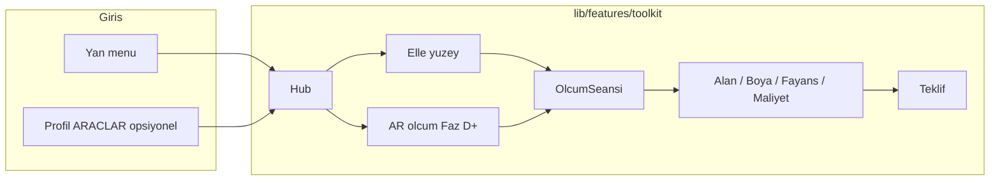

# PRD / Tasarım: Usta Çantası — Saha Hesap & AR Ölçüm Araç Seti

| Alan | Değer |
|------|--------|
| **Belge** | PRD-007 Usta Çantası (canonical) |
| **Proje** | Ustasından / Usta Cepte (`alljob1`) |
| **Tarih** | 2026-07-21 |
| **Revizyon** | r2 — kod gerçekleriyle doğrulandı; Faz A uygulandı |
| **Durum** | Uygulama başladı — **Faz A ✅ (2026-07-22)**; aktif faz: B |
| **İlgili** | `PRD.md` v4.0 · `ILERLEME_NOTLARI.md` · Profil ARAÇLAR (Ajanda / Eleman / Ürünlerim) |
| **PRD kaynağı** | **Bu belge Usta Çantası için kanonik kaynaktır.** `PRD.md`'ye kısa stub eklenebilir; dual source riskini bilerek yönet. |
| **Kapsam kodu** | Yeni feature: `lib/features/toolkit/` — **Firebase / rules / CF yok** (yerel saf Dart + UI). AR native paketleri Faz D'de. |

### İlerleme kaydı kuralı (zorunlu)

Her faz bittiğinde:

1. Bu belgede **§0 Faz panosu** satırını güncelle (`✅` + tarih).
2. `ILERLEME_NOTLARI.md` → **Son Durum**'a oturum notu düş:

   > `Faz X bitti → Faz Y'ye geçiyoruz. Kaynak: docs/PRD_007_USTA_CANTASI.md`

3. Commit mesajında `PRD-007 Faz X` geçsin (tercihen).

---

## 0. Faz panosu (kaldığımız yer)

| Faz | Ad | Durum | Not |
|-----|-----|--------|-----|
| **A** | İskelet (hub, rota, drawer, ortak modeller, uyarı banner) | ✅ **BİTTİ (2026-07-22)** | `lib/features/toolkit/` + hub + drawer + profil satırı |
| **B** | Ölçüm hesapları (Alan, Boya, Fayans) | ✅ **BİTTİ (2026-07-22)** | Motor + 3 ekran + sonuç kartı/kopyala + 22 test |
| **C** | İş & maliyet + diğer (Maliyet, Kâr, Teklif, birim, süre) | ✅ **BİTTİ (2026-07-22)** | 5 ekran + motor + 32 test |
| **D** | AR-1 (iki nokta uzunluk + seansa aktar) | ✅ **KOD BİTTİ (2026-07-22)** — cihaz testi bekliyor | `ar_flutter_plugin_plus` + AR-1 ekran + `uzunlukM` testli; analyze 0 |
| **E** | AR-2 (dikdörtgen m²) + hesaplayıcıya köprü | 🟡 **KÖPRÜ HAZIR** | AR→Alan aktarımı (`?ar_uzunluk=`) + kaynak rozeti çalışıyor; AR-2 dikdörtgen m² sonra |
| **F** | Cilâ (FAQ, analytics opsiyonel, mağaza görselleri) | ✅ **BİTTİ (2026-07-22)** | Yardım'a 2 FAQ + kategori; hub Yardım linki; ölü kod temizlendi |

**⚠️ AR yayın öncesi kontrol (kullanıcı, gerçek cihaz + mağaza):**
1. **Android:** ARCore destekli gerçek cihazda `flutter run`; AR ekranı açılıp iki noktaya dokun → uzunluk çıkıyor mu; desteksiz/izinsiz cihazda AppBar "Elle ölç" çalışıyor mu.
2. **iOS:** macOS'ta `cd ios && pod install`; ARKit'li iPhone'da test. (Windows'ta iOS build yapılamaz.)
3. **Sürüm:** `pubspec.yaml` `version:` bump; yeni bağımlılık = yeni mağaza sürümü.
4. **App Check / Play Integrity:** release imzası kaydı (bkz. Oturum 68 notu) — AR CF çağırmıyor ama sürüm yenilendiği için kontrol et.
5. **Boyut:** ARCore SDK APK boyutunu büyütür; App Bundle + `debuggable false` (release zaten öyle) — ARCore tracking bug'ı için önemli.

**Şu an:** Faz A–F kod tarafı bitti (hub + 8 hesaplayıcı + gerçek AR-1 ölçüm + AR→Alan köprüsü + FAQ; misafir açık; toolkit 36 test, tüm suite 254/254, analyze 0). `ar_flutter_plugin_plus` eklendi, platform ayarları yapıldı (Android minSdk 24 + ARCore meta-data, iOS 15 + kamera izin metni). **Kalan tek iş: GERÇEK CİHAZDA test + mağaza yayını** (emülatörde AR çalışmaz) + iOS için macOS'ta `pod install`. AR-2 (dikdörtgen m² doğrudan AR) sonraki iyileştirme.

---

## 1. Overview

Ustasından bugün usta–müşteri buluşması, ilan, sohbet, eleman, ürün vitrini ve Profil → ARAÇLAR (Ajanda, Eleman, Ürünlerim) sunar. **Usta Çantası**, saha ölçümü ve malzeme/teklif hesabını **çevrimdışı, giriş zorunluluğu olmadan** sunan ayrı bir araç setidir.

**Çekirdek vaat:** Ölç → hesapla → teklife dök.
Ölçüm **elle** veya (sonraki fazlarda) **AR kamera** ile girilir; boya / fayans / maliyet aynı `OlcumSeansi` modelini besler.

**Kritik ilke:** Tüm ölçüm ve ihtiyaçlar **tahminidir**. Her sonuç ekranında zorunlu metin:

> Tahmini ölçüm / tahmini ihtiyaçtır. Profesyonel uygulamalar için fiziksel ölçü aletiyle doğrulayın.

---

## 2. Background & Motivation

### 2.1 Mevcut durum (kod gerçekleri — doğrulandı)

| Alan | Kod / path | Not |
|------|------------|-----|
| Drawer | `lib/core/widgets/app_menu_drawer.dart` | `_open(context, path)` = `Navigator.pop` + `context.push`; `ListTile` kalıbı |
| Router | `lib/core/router/app_router.dart` + `route_paths.dart` | `redirect` içinde `needsLogin` listesi (whitelist mantığı) |
| Profil ARAÇLAR | `lib/features/profile/presentation/profile_screen.dart` | `_SectionLabel('ARAÇLAR')` + `_Group`/`_MenuRow`; Ajanda, Eleman, Ürünlerim |
| TR ondalık | `lib/core/utils/validators.dart` → `Validators.parseTrAmount` | "1.500,50" → 1500.5; Faz B/C girdi parse'ı |
| Offline kalıp | `lib/features/tracking/application/` | Yerel-öncelikli referans; çanta MVP'sinde Firebase **yok** |
| Kamera izni | AndroidManifest + iOS Info.plist | `image_picker` için mevcut; AR amaç cümlesi Faz D'de güncellenir |

### 2.2 Pain points

- Usta saha hesabı için harici uygulama / kâğıt kullanıyor; marka "iş günü boyunca cepte" vaadini kaçırıyor.
- AR ölçüm rekabetçi farklılaştırıcı; tek başına hesap olmadan az değer, hesap olmadan AR yarım ürün.
- "Kesin ölçü" iddiası yasal ve güven riski.

### 2.3 Bağımlılık (hedef)



---

## 3. Goals & Non-Goals

### Goals

- Yan menüden tek dokunuş: **Usta Çantası**.
- Misafir dahil çalışır (`needsLogin` **yok**).
- Saf Dart hesaplar + unit test; Firebase deploy **gerekmez** (A–C).
- AR, hesaplardan **ayrı girdi kaynağı**; ortak seans modeli.
- Tüm UI Türkçe; "tahmini" dili zorunlu.

### Non-Goals (bilinçli)

- Alt bara 5. sekme eklemek.
- Profesyonel lazer / sertifikalı ölçüm iddiası.
- İlk sürümde bulut senkron / Firestore geçmiş.
- Statik, basınç, elektrik proje mühendisliği hesapları.
- Ajanda / Eleman / Ürünlerim'i çanta içine taşımak (ayrı kalırlar).

---

## 4. Bilgi mimarisi (IA)

### 4.1 Giriş noktaları

| Yer | Davranış |
|-----|----------|
| **Drawer** | `ListTile` **Usta Çantası** → `/toolkit` (misafir + oturum) |
| **Profil → ARAÇLAR** | İkinci kapı — `_MenuRow` (Faz A'da eklendi) |
| Alt bar | **Dokunulmaz** (4 sekme) |

### 4.2 Hub menü

```
Usta Çantası
│
├─ 📷 Ölç (AR)                 ← yıldız; Faz D'ye kadar "Yakında" gri kart
│
├─ 📏 Ölçüm
│   ├ Alan Hesapla             ← Faz B
│   ├ Boya Hesapla             ← Faz B
│   └ Fayans Hesapla           ← Faz B
│
├─ 💰 İş & Maliyet
│   ├ Maliyet Hesapla          ← Faz C
│   ├ Kâr Hesapla              ← Faz C
│   └ Teklif Oluştur           ← Faz C
│
└─ 🔧 Diğer
    ├ Birim Dönüştürücü        ← Faz C
    └ İş Süresi Tahmini        ← Faz C
```

**Faz A davranışı:** B–D kartları hub'da görünür ama pasif ("Yakında" rozeti); yalnız hub aktif.

---

## 5. Domain modeli (çekirdek — Faz A iskeleti)

Hesaplayıcılar AR'dan bağımsızdır. AR yalnız girdi üretir.

| Kavram | Anlam | Faz A durumu |
|--------|-------|--------------|
| `Yuzey` | Dikdörtgen (en×boy m) veya doğrudan alan m²; opsiyonel düşümler | ✅ minimal, immutable |
| `FireOrani` | 0 / 0.05 / 0.10 / 0.15 / özel | ✅ enum + oran |
| `OlcuKaynagi` | `manuel` \| `ar` | ✅ enum |
| `OlcumSeansi` | Yüzey listesi + etiket + kaynak + zaman | ✅ minimal |
| `HesapSonucu` | netAlanM2, adet, litre, tutar… + `tahmini: true` | Faz B'de büyür |

**Veri akışı:**

```
[Elle] ──┐
         ├→ OlcumSeansi → Hesaplayici → Sonuc → (opsiyonel) Teklif kalemi
[AR]  ───┘
```

Kalıcılık MVP: bellek / ekran state yeter. İleride SharedPreferences veya sqflite (opsiyonel, ayrı karar).

---

## 6. Araç sözleşmeleri

### 6.1 Alan Hesaplayıcı (Faz B)

- Girdi: bir veya çok yüzey (en×boy); düşümler; fire %.
- Çıktı: brüt m², düşüm m², net m² (fire'lı/firesiz ayrımı net).
- Metin: "Net alan (tahmini): X m²".

### 6.2 Boya Hesaplayıcı (Faz B)

- Girdi: alan veya seans; kat sayısı; m²/L verim; düşüm.
- Çıktı: **Tahmini boya ihtiyacı: X litre** (asla "kesin").
- Opsiyonel Faz F: kutu yuvarlama ipucu.

### 6.3 Fayans Hesaplayıcı (Faz B)

- Girdi: alan/seans; fayans en×boy cm; derz mm; fire çipleri %5/%10/%15/özel.
- Çıktı: net alan + yaklaşık adet (fire dahil cümle).

### 6.4 Maliyet / Kâr / Teklif (Faz C)

- Maliyet: malzeme + işçilik + yol + diğer.
- Kâr: % veya sabit → satış.
- Teklif: kalemler, KDV (TR %20 seçeneği), not, panoya kopyala / sistem paylaşımı.
- Hesap sonucundan "kaleme ekle".

### 6.5 Birim + süre (Faz C)

- Birim: m/cm/mm, m², L/mL, kg/g, inç↔cm.
- Süre: m² × meslek şablonu (düzenlenebilir) → tahmini saat/gün.

### 6.6 AR (Faz D–E) — ürün önceliği

| Alt faz | Kapsam |
|---------|--------|
| AR-1 | Düzlemde iki nokta → uzunluk (m); seansa kaydet; hesaplayıcıya aktar |
| AR-2 | Dikdörtgen en+boy → m²; boya/fayans "Ölçümden al" |
| AR-3+ (sonra) | Çoklu yüzey, oda, foto anotasyon — bu PRD revizyonu |

Kurallar:

1. Destek yoksa çökme yok → elle ölçüm.
2. Sürekli "tahmini" banner.
3. Sonuçta kaynak rozeti: AR / Manuel.
4. Spike: Flutter ARCore/ARKit köprüsü 1–2 gün (Faz D başı).

**Faz D başlangıç kontrol listesi (PC başında, kullanıcı onayıyla):**

1. **Paket kararı:** `ar_flutter_plugin` / `arcore_flutter_plugin` + `arkit_plugin` ya da tek köprü. `pubspec.yaml`'a ekle → `flutter pub get`. (Yeni bağımlılık = yeni mağaza sürümü.)
2. **İzin metni:** AndroidManifest kamera + `<uses-feature android:name="android.hardware.camera.ar">`; iOS `Info.plist` `NSCameraUsageDescription` metnini "AR ölçüm" amacıyla güncelle.
3. **Cihaz desteği:** açılışta ARCore/ARKit var mı kontrol et; yoksa `ar_screen.dart` zaten elle ölçüme yönlendiriyor (bu ekranı gerçek AR ile değiştir).
4. **AR-1 kapsam:** düzlem algıla → 2 nokta koy → uzunluk (m) → `OlcumSeansi.yuzeyEkle` ile `Yuzey.dikdortgen`e/`Yuzey.alan`a aktar (`OlcuKaynagi.ar`). Kaynak rozeti `SonucKarti`'nda gösterilecek (küçük ekleme).
5. **Test:** saf hesap zaten testli; AR UI için manuel cihaz testi + desteksiz cihazda çökme-yok widget testi.
6. **Yayın:** versiyon bump + Play Integrity/App Check release kaydı (bkz. Oturum 68 notu) + duman testi.

---

## 7. Ek değer araçları (backlog — bu PRD revizyonu dışı öncelik)

Piyasa değeri yüksek; mimariye uyumlu; **A–E bitmeden zorunlu değil:**

- Alçı/sıva torba hesabı
- Duvar kağıdı rulo
- Şap/beton m³
- Boru/kablo metre + fire
- Merdiven basamak
- Malzeme listesi (alışveriş)
- Foto + not + ölçü seans kaydı

---

## 8. Teknik tasarım

### 8.1 Klasör (Faz A uygulandı)

```
lib/features/toolkit/
  application/
    toolkit_models.dart      # Yuzey, FireOrani, OlcuKaynagi, OlcumSeansi
  presentation/
    toolkit_hub_screen.dart  # hub
    widgets/
      tahmini_uyari_banner.dart
```

### 8.2 Rotalar

| Path | Ekran | Faz | Durum |
|------|--------|-----|-------|
| `/toolkit` | Hub | A | ✅ |
| `/toolkit/area` | Alan | B | ⏳ |
| `/toolkit/paint` | Boya | B | ⏳ |
| `/toolkit/tile` | Fayans | B | ⏳ |
| `/toolkit/cost` | Maliyet | C | ⏳ |
| `/toolkit/profit` | Kâr | C | ⏳ |
| `/toolkit/quote` | Teklif | C | ⏳ |
| `/toolkit/units` | Birim | C | ⏳ |
| `/toolkit/duration` | Süre | C | ⏳ |
| `/toolkit/ar` | AR | D | ⏳ |

`RoutePaths.toolkit` + `app_router.dart`.
**`needsLogin` listesine EKLENMEDİ** — misafir açık (doğrulandı).

### 8.3 Bağımlılıklar

- A–C: yeni pub paketi yok.
- D: AR eklentisi + kamera metin güncellemesi → yeni mağaza sürümü.

### 8.4 Test

- `test/toolkit_*_test.dart`: saf formüller (TR ondalık: `Validators.parseTrAmount` kalıbı).
- Widget: hub rotaları (hafif). Faz A: 1 smoke test (hub açılır).

---

## 9. Faz dökümü (uygulama sözleşmesi)

### Faz A — İskelet ✅ (2026-07-22)

**Uygulanan:**

1. `RoutePaths.toolkit` (+ alt path sabitleri).
2. `app_router`: `/toolkit` rotası — `needsLogin`'e eklenmedi (misafir açık).
3. Drawer: **Usta Çantası** satırı (Yardım üstünde; misafir+üye).
4. Profil ARAÇLAR: **Usta Çantası** `_MenuRow`.
5. `ToolkitHubScreen`: gruplar, kartlar, B–D kartları "Yakında".
6. Ortak widget: `TahminiUyariBanner`.
7. `application/toolkit_models.dart`: `Yuzey`, `FireOrani`, `OlcuKaynagi`, `OlcumSeansi`.
8. Analyze temiz; hub smoke test.

**Kabul:** Drawer → hub açılır (girişsiz). Alt bar bozulmaz. Deploy yok. ✅

### Faz B — Ölçüm hesapları 🔜

Alan + Boya + Fayans tam UX + unit testler + sonuç kartı + kopyala/paylaş metin.
**Bitiş:** `Faz B bitti → Faz C'ye geçiyoruz. Kaynak: docs/PRD_007_USTA_CANTASI.md`

### Faz C — İş & maliyet + diğer

Maliyet, Kâr, Teklif, birim, süre.
**Bitiş:** `Faz C bitti → Faz D'ye geçiyoruz. Kaynak: docs/PRD_007_USTA_CANTASI.md`

### Faz D — AR-1

Spike + iki nokta uzunluk + seans + aktar.
**Bitiş:** `Faz D bitti → Faz E'ye geçiyoruz. Kaynak: docs/PRD_007_USTA_CANTASI.md`

### Faz E — AR-2 + köprü

Dikdörtgen m² + boya/fayans "Ölçümden al".
**Bitiş:** `Faz E bitti → Faz F'ye geçiyoruz. Kaynak: docs/PRD_007_USTA_CANTASI.md`

### Faz F — Cilâ

FAQ, opsiyonel analytics, mağaza görselleri notu.
**Bitiş:** `Faz F bitti — Usta Çantası MVP tamam. Kaynak: docs/PRD_007_USTA_CANTASI.md`

---

## 10. Karar tablosu (K)

| ID | Karar | Değer |
|----|--------|--------|
| K1 | Ana giriş | Drawer **Usta Çantası** |
| K2 | Auth | Misafir açık |
| K3 | Backend | Yok (yerel) |
| K4 | Sıra | Hesap seansı önce, AR sonra |
| K5 | AR MVP | İki nokta uzunluk + aktar |
| K6 | Dil | TR + tahmini zorunlu |
| K7 | Alt bar | Dokunulmaz |
| K8 | Mevcut ARAÇLAR | Ayrı kalır |
| K9 | İlerleme | Her faz sonu `ILERLEME_NOTLARI` + bu §0 panosu |
| K10 | Hub'da gelecek fazlar | Kart görünür + "Yakında" (keşif için) |

---

## 11. Riskler

| Risk | Önlem |
|------|--------|
| AR güven kaybı | Tahmini dili + doğrulama uyarısı |
| Cihaz uyumsuzluğu | Manuel yol her zaman |
| Kapsam şişmesi | A→B→C→D sırası; backlog ayır |
| Paket dengesizliği | Faz D spike zorunlu |

---

## 12. Acceptance Criteria (genel MVP = A–E)

1. Drawer'dan Usta Çantası açılır (girişsiz). ✅ (Faz A)
2. Alan + düşüm + fire → net m² doğru (test + UI).
3. Fayans: alan + ebat + derz + fire → adet formülü testli.
4. Boya: her yerde "tahmini ihtiyaç".
5. AR-1 destekli cihazda uzunluk → seans → hesaplayıcı.
6. Desteksiz cihazda çökme yok.
7. Analyze 0; toolkit unit testleri yeşil.

---

## 13. Open Questions

| # | Soru | Varsayılan |
|---|------|------------|
| Q1 | Profil'e de satır? | ✅ Evet, Faz A'da eklendi |
| Q2 | Teklif PDF? | Hayır (Faz F+); önce metin paylaş |
| Q3 | Seans kalıcılığı? | A–C bellek; kullanıcı isterse sonra sqflite |

---

## 14. References

- Kullanıcı brief: Usta Çantası hub + ölçüm / maliyet / AR önceliği (2026-07-21).
- Codebase: `app_menu_drawer.dart`, `profile_screen.dart` ARAÇLAR, `tracking/application/` offline kalıbı, `Validators.parseTrAmount`.
- `docs/PRD_006_URUN_YASAM_DONGUSU.md` — belge stili referansı (domain farklı).
